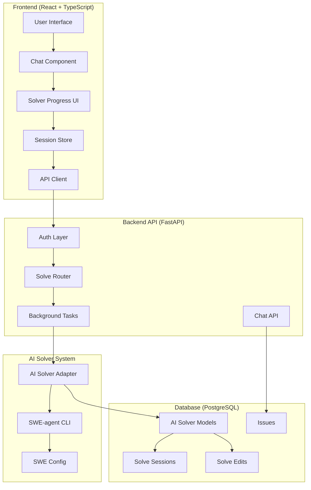

# AI Solver System Architecture & Implementation Plan

## System Overview

This document outlines the comprehensive architecture for integrating SWE-agent as an AI solver into the YudaiV3 system. The implementation focuses on core solver functionality without GitHub PR creation, emphasizing real-time progress tracking and seamless frontend integration.

## Architecture Diagram



## Revised Implementation Plan

### **PR-01: Database & Schemas**
**Status**: Pending
**Dependencies**: None

#### Database Models

```sql
-- AI Model configurations
CREATE TABLE ai_models (
    id SERIAL PRIMARY KEY,
    name VARCHAR(255) NOT NULL,
    provider VARCHAR(100) NOT NULL,
    model_id VARCHAR(255) NOT NULL,
    config JSON,
    is_active BOOLEAN DEFAULT true,
    created_at TIMESTAMP WITH TIME ZONE DEFAULT NOW(),
    updated_at TIMESTAMP WITH TIME ZONE DEFAULT NOW()
);

-- SWE-agent configurations
CREATE TABLE swe_agent_configs (
    id SERIAL PRIMARY KEY,
    name VARCHAR(255) NOT NULL,
    config_path VARCHAR(500) NOT NULL,
    parameters JSON,
    is_default BOOLEAN DEFAULT false,
    created_at TIMESTAMP WITH TIME ZONE DEFAULT NOW(),
    updated_at TIMESTAMP WITH TIME ZONE DEFAULT NOW()
);

-- AI Solve Sessions
CREATE TABLE ai_solve_sessions (
    id SERIAL PRIMARY KEY,
    user_id INTEGER REFERENCES users(id) NOT NULL,
    issue_id INTEGER REFERENCES issues(id) NOT NULL,
    ai_model_id INTEGER REFERENCES ai_models(id),
    swe_config_id INTEGER REFERENCES swe_agent_configs(id),
    status VARCHAR(50) DEFAULT 'pending', -- pending, running, completed, failed, cancelled
    repo_url VARCHAR(1000),
    branch_name VARCHAR(255) DEFAULT 'main',
    trajectory_data JSON,
    error_message TEXT,
    started_at TIMESTAMP WITH TIME ZONE,
    completed_at TIMESTAMP WITH TIME ZONE,
    created_at TIMESTAMP WITH TIME ZONE DEFAULT NOW(),
    updated_at TIMESTAMP WITH TIME ZONE DEFAULT NOW()
);

-- Individual edits made by the solver
CREATE TABLE ai_solve_edits (
    id SERIAL PRIMARY KEY,
    session_id INTEGER REFERENCES ai_solve_sessions(id) NOT NULL,
    file_path VARCHAR(1000) NOT NULL,
    edit_type VARCHAR(50) NOT NULL, -- create, modify, delete
    original_content TEXT,
    new_content TEXT,
    line_start INTEGER,
    line_end INTEGER,
    metadata JSON,
    created_at TIMESTAMP WITH TIME ZONE DEFAULT NOW()
);

-- Indexes for performance
CREATE INDEX idx_ai_solve_sessions_user_id ON ai_solve_sessions(user_id);
CREATE INDEX idx_ai_solve_sessions_status ON ai_solve_sessions(status);
CREATE INDEX idx_ai_solve_sessions_created_at ON ai_solve_sessions(created_at);
CREATE INDEX idx_ai_solve_edits_session_id ON ai_solve_edits(session_id);
```

#### Pydantic Schemas

```python
# backend/schemas/ai_solver.py
from datetime import datetime
from typing import List, Optional, Dict, Any
from pydantic import BaseModel, ConfigDict
from enum import Enum

class SolveStatus(str, Enum):
    PENDING = "pending"
    RUNNING = "running"
    COMPLETED = "completed"
    FAILED = "failed"
    CANCELLED = "cancelled"

class EditType(str, Enum):
    CREATE = "create"
    MODIFY = "modify"
    DELETE = "delete"

# Output schemas
class AIModelOut(BaseModel):
    id: int
    name: str
    provider: str
    model_id: str
    config: Optional[Dict[str, Any]] = None
    is_active: bool
    created_at: datetime
    updated_at: datetime
    
    model_config = ConfigDict(from_attributes=True)

class SWEAgentConfigOut(BaseModel):
    id: int
    name: str
    config_path: str
    parameters: Optional[Dict[str, Any]] = None
    is_default: bool
    created_at: datetime
    updated_at: datetime
    
    model_config = ConfigDict(from_attributes=True)

class SolveEditOut(BaseModel):
    id: int
    session_id: int
    file_path: str
    edit_type: EditType
    original_content: Optional[str] = None
    new_content: Optional[str] = None
    line_start: Optional[int] = None
    line_end: Optional[int] = None
    metadata: Optional[Dict[str, Any]] = None
    created_at: datetime
    
    model_config = ConfigDict(from_attributes=True)

class SolveSessionOut(BaseModel):
    id: int
    user_id: int
    issue_id: int
    ai_model_id: Optional[int] = None
    swe_config_id: Optional[int] = None
    status: SolveStatus
    repo_url: Optional[str] = None
    branch_name: str
    trajectory_data: Optional[Dict[str, Any]] = None
    error_message: Optional[str] = None
    started_at: Optional[datetime] = None
    completed_at: Optional[datetime] = None
    created_at: datetime
    updated_at: datetime
    
    # Related data
    edits: List[SolveEditOut] = []
    ai_model: Optional[AIModelOut] = None
    swe_config: Optional[SWEAgentConfigOut] = None
    
    model_config = ConfigDict(from_attributes=True)

class SolveSessionStatsOut(BaseModel):
    session_id: int
    status: SolveStatus
    total_edits: int
    files_modified: int
    lines_added: int
    lines_removed: int
    duration_seconds: Optional[int] = None
    last_activity: Optional[datetime] = None
    trajectory_steps: int
    
    model_config = ConfigDict(from_attributes=True)
```

### **PR-02: SWE-agent Bootstrap**
**Status**: Pending
**Dependencies**: PR-01

#### SWE-agent Configuration

```yaml
# backend/solver/config.yaml
agent:
  model:
    model_name: "openrouter/anthropic/claude-3.5-sonnet"
    temperature: 0.1
    max_tokens: 4000
  
environment:
  image: "sweagent/swe-agent:latest"
  data_path: "/data/swe_runs"
  repo_path: "/tmp/repo"
  
commands:
  install: "pip install -e ."
  test: "python -m pytest"
  
limits:
  max_iterations: 50
  max_time_seconds: 1800  # 30 minutes
  max_cost: 10.0  # $10 max per solve
  
logging:
  level: "INFO"
  trajectory_path: "/data/swe_runs/trajectories"
```

#### Environment Setup

```bash
# backend/solver/.env.example
# OpenRouter API Key for SWE-agent
OPENROUTER_API_KEY=your_openrouter_key_here

# SWE-agent Configuration
SWEAGENT_CONFIG_PATH=/app/solver/config.yaml
SWEAGENT_DATA_PATH=/data/swe_runs
SWEAGENT_LOG_LEVEL=INFO

# Solver Limits
MAX_SOLVE_TIME_MINUTES=30
MAX_CONCURRENT_SOLVES=3
SOLVER_TIMEOUT_SECONDS=1800
```

#### Requirements Update

```txt
# Add to requirements.txt
sweagent>=1.1.0
swe-rex>=1.2.0
docker>=6.0.0
pyyaml>=6.0.0
```

#### Docker Configuration

```yaml
# Update docker-compose.prod.yml
services:
  backend:
    volumes:
      - /var/run/docker.sock:/var/run/docker.sock
      - swe_runs:/data/swe_runs
      - ./backend/solver:/app/solver
    environment:
      - SWEAGENT_CONFIG_PATH=/app/solver/config.yaml
      - SWEAGENT_DATA_PATH=/data/swe_runs
      - OPENROUTER_API_KEY=${OPENROUTER_API_KEY}

volumes:
  swe_runs:
    driver: local
```

### **PR-04: Solver CLI Adapter (No GitHub Integration)**
**Status**: Pending
**Dependencies**: PR-01, PR-02

#### Core Solver Implementation

```python
# backend/solver/ai_solver.py
import asyncio
import json
import subprocess
import tempfile
import shutil
from datetime import datetime
from pathlib import Path
from typing import Dict, Any, Optional, List
from sqlalchemy.orm import Session
from models import AISolveSession, AISolveEdit, Issue, User
from schemas.ai_solver import SolveStatus, EditType

class AISolverAdapter:
    def __init__(self, db: Session):
        self.db = db
        self.config_path = "/app/solver/config.yaml"
        self.data_path = "/data/swe_runs"
    
    async def run_solver(
        self,
        issue_id: int,
        user_id: int,
        repo_url: str,
        branch: str = "main"
    ) -> int:
        """
        Main solver entry point - creates session and runs SWE-agent
        Returns session_id for tracking
        """
        # Create solve session
        session = AISolveSession(
            user_id=user_id,
            issue_id=issue_id,
            status=SolveStatus.PENDING,
            repo_url=repo_url,
            branch_name=branch,
            started_at=datetime.utcnow()
        )
        self.db.add(session)
        self.db.commit()
        self.db.refresh(session)
        
        try:
            # Update status to running
            session.status = SolveStatus.RUNNING
            self.db.commit()
            
            # Get issue details
            issue = self.db.query(Issue).filter(Issue.id == issue_id).first()
            if not issue:
                raise ValueError(f"Issue {issue_id} not found")
            
            # Run SWE-agent
            trajectory = await self._execute_sweagent(
                session.id,
                repo_url,
                issue.title,
                issue.body or "",
                branch
            )
            
            # Process trajectory and extract edits
            await self._process_trajectory(session.id, trajectory)
            
            # Update session as completed
            session.status = SolveStatus.COMPLETED
            session.completed_at = datetime.utcnow()
            session.trajectory_data = trajectory
            
        except Exception as e:
            # Update session as failed
            session.status = SolveStatus.FAILED
            session.error_message = str(e)
            session.completed_at = datetime.utcnow()
            
        finally:
            self.db.commit()
        
        return session.id
    
    async def _execute_sweagent(
        self,
        session_id: int,
        repo_url: str,
        issue_title: str,
        issue_body: str,
        branch: str
    ) -> Dict[str, Any]:
        """Execute SWE-agent CLI command"""
        
        # Create temporary directory for this solve
        with tempfile.TemporaryDirectory() as temp_dir:
            repo_path = Path(temp_dir) / "repo"
            
            # Clone repository
            clone_cmd = [
                "git", "clone", 
                "--branch", branch,
                "--single-branch",
                repo_url, 
                str(repo_path)
            ]
            
            result = subprocess.run(clone_cmd, capture_output=True, text=True)
            if result.returncode != 0:
                raise RuntimeError(f"Failed to clone repository: {result.stderr}")
            
            # Prepare issue text for SWE-agent
            issue_text = f"{issue_title}\n\n{issue_body}"
            
            # Run SWE-agent
            sweagent_cmd = [
                "sweagent", "run",
                "--config", self.config_path,
                "--repo_path", str(repo_path),
                "--data_path", f"{self.data_path}/session_{session_id}",
                "--problem_statement", issue_text,
                "--output_dir", f"{self.data_path}/session_{session_id}/output"
            ]
            
            # Execute with timeout
            process = await asyncio.create_subprocess_exec(
                *sweagent_cmd,
                stdout=asyncio.subprocess.PIPE,
                stderr=asyncio.subprocess.PIPE,
                cwd=str(repo_path)
            )
            
            try:
                stdout, stderr = await asyncio.wait_for(
                    process.communicate(), 
                    timeout=1800  # 30 minutes
                )
                
                if process.returncode != 0:
                    raise RuntimeError(f"SWE-agent failed: {stderr.decode()}")
                
                # Parse trajectory output
                trajectory_file = Path(self.data_path) / f"session_{session_id}" / "trajectory.json"
                if trajectory_file.exists():
                    with open(trajectory_file) as f:
                        return json.load(f)
                else:
                    # Fallback: create basic trajectory from stdout
                    return {
                        "steps": [],
                        "final_state": "completed",
                        "stdout": stdout.decode(),
                        "stderr": stderr.decode()
                    }
                    
            except asyncio.TimeoutError:
                process.kill()
                raise RuntimeError("SWE-agent execution timed out")
    
    async def _process_trajectory(self, session_id: int, trajectory: Dict[str, Any]):
        """Process trajectory and extract file edits"""
        
        steps = trajectory.get("steps", [])
        
        for step in steps:
            if step.get("action", {}).get("command") == "str_replace_editor":
                # Extract file edit information
                args = step.get("action", {}).get("args", {})
                file_path = args.get("path")
                
                if file_path:
                    # Determine edit type and content
                    if "new_str" in args and "old_str" in args:
                        edit_type = EditType.MODIFY
                        original_content = args.get("old_str")
                        new_content = args.get("new_str")
                    elif args.get("command") == "create":
                        edit_type = EditType.CREATE
                        original_content = None
                        new_content = args.get("file_text", "")
                    else:
                        continue
                    
                    # Create edit record
                    edit = AISolveEdit(
                        session_id=session_id,
                        file_path=file_path,
                        edit_type=edit_type,
                        original_content=original_content,
                        new_content=new_content,
                        metadata={
                            "step_index": step.get("step_index"),
                            "timestamp": step.get("timestamp"),
                            "command": args.get("command")
                        }
                    )
                    self.db.add(edit)
        
        self.db.commit()
    
    def get_session_status(self, session_id: int) -> Optional[Dict[str, Any]]:
        """Get current status of a solve session"""
        session = self.db.query(AISolveSession).filter(
            AISolveSession.id == session_id
        ).first()
        
        if not session:
            return None
        
        edits = self.db.query(AISolveEdit).filter(
            AISolveEdit.session_id == session_id
        ).all()
        
        return {
            "session_id": session.id,
            "status": session.status,
            "started_at": session.started_at,
            "completed_at": session.completed_at,
            "error_message": session.error_message,
            "total_edits": len(edits),
            "files_modified": len(set(edit.file_path for edit in edits)),
            "trajectory_steps": len(session.trajectory_data.get("steps", [])) if session.trajectory_data else 0
        }
```

### **PR-05: API & Router**
**Status**: Pending
**Dependencies**: PR-04

#### API Endpoints

```python
# backend/routers/solve_router.py
from fastapi import APIRouter, Depends, HTTPException, BackgroundTasks
from sqlalchemy.orm import Session
from db.database import get_db
from auth.auth_utils import get_current_user
from models import User, Issue
from solver.ai_solver import AISolverAdapter
from schemas.ai_solver import SolveSessionOut, SolveSessionStatsOut
from typing import Dict, Any

router = APIRouter()

# Always-true auth validation (as requested)
async def validate_auth_payment(user: User = Depends(get_current_user)) -> bool:
    """
    TODO: Implement proper auth and payment validation
    Current implementation: Always returns True
    
    Future requirements:
    - Check user subscription status
    - Verify payment method
    - Check usage limits
    - Validate API quotas
    - Rate limiting per user
    """
    return True

@router.post("/issues/{issue_id}/solve")
async def start_solve_session(
    issue_id: int,
    background_tasks: BackgroundTasks,
    db: Session = Depends(get_db),
    user: User = Depends(get_current_user),
    auth_valid: bool = Depends(validate_auth_payment)
) -> Dict[str, Any]:
    """Start AI solver for an issue"""
    
    # Get issue details
    issue = db.query(Issue).filter(Issue.id == issue_id).first()
    if not issue:
        raise HTTPException(status_code=404, detail="Issue not found")
    
    # Get repository URL from issue
    repo = issue.repository
    if not repo:
        raise HTTPException(status_code=400, detail="Issue has no associated repository")
    
    # Create solver adapter
    solver = AISolverAdapter(db)
    
    # Start solver in background
    background_tasks.add_task(
        solver.run_solver,
        issue_id=issue_id,
        user_id=user.id,
        repo_url=repo.clone_url or repo.html_url,
        branch="main"
    )
    
    # Return session info immediately
    return {
        "message": "Solver started successfully",
        "issue_id": issue_id,
        "status": "started"
    }

@router.get("/solve-sessions/{session_id}")
async def get_solve_session(
    session_id: int,
    db: Session = Depends(get_db),
    user: User = Depends(get_current_user)
) -> SolveSessionOut:
    """Get solve session details"""
    
    session = db.query(AISolveSession).filter(
        AISolveSession.id == session_id,
        AISolveSession.user_id == user.id
    ).first()
    
    if not session:
        raise HTTPException(status_code=404, detail="Solve session not found")
    
    return SolveSessionOut.model_validate(session)

@router.get("/solve-sessions/{session_id}/stats")
async def get_solve_session_stats(
    session_id: int,
    db: Session = Depends(get_db),
    user: User = Depends(get_current_user)
) -> SolveSessionStatsOut:
    """Get solve session statistics"""
    
    solver = AISolverAdapter(db)
    stats = solver.get_session_status(session_id)
    
    if not stats:
        raise HTTPException(status_code=404, detail="Solve session not found")
    
    return SolveSessionStatsOut(**stats)
```

### **Frontend Integration: Solver Progress UI**
**Status**: Pending
**Dependencies**: PR-05

#### Enhanced Session Store

```typescript
// src/stores/sessionStore.ts - Add solver state
interface SessionState {
  // ... existing state ...
  
  // Solver state
  activeSolveSession: string | null;
  solveStatus: 'idle' | 'running' | 'completed' | 'failed';
  solveProgress: {
    totalSteps: number;
    currentStep: number;
    currentAction: string;
    filesModified: number;
    editsCount: number;
  };
  
  // Solver actions
  startSolver: (issueId: number) => Promise<void>;
  getSolverStatus: (sessionId: string) => Promise<void>;
  cancelSolver: (sessionId: string) => Promise<void>;
}
```

#### API Service Extensions

```typescript
// src/services/api.ts - Add solver endpoints
export class ApiService {
  // ... existing methods ...
  
  // Solver API Methods
  static async startSolver(issueId: number, sessionToken?: string): Promise<{message: string, issue_id: number, status: string}> {
    const response = await fetch(`${API_BASE_URL}/issues/${issueId}/solve`, {
      method: 'POST',
      headers: ApiService.getAuthHeaders(sessionToken),
    });
    return ApiService.handleResponse(response);
  }
  
  static async getSolveSession(sessionId: string, sessionToken?: string): Promise<SolveSessionOut> {
    const response = await fetch(`${API_BASE_URL}/solve-sessions/${sessionId}`, {
      method: 'GET',
      headers: ApiService.getAuthHeaders(sessionToken),
    });
    return ApiService.handleResponse(response);
  }
  
  static async getSolveSessionStats(sessionId: string, sessionToken?: string): Promise<SolveSessionStatsOut> {
    const response = await fetch(`${API_BASE_URL}/solve-sessions/${sessionId}/stats`, {
      method: 'GET',
      headers: ApiService.getAuthHeaders(sessionToken),
    });
    return ApiService.handleResponse(response);
  }
}
```

#### Solver Progress Component

```typescript
// src/components/SolverProgress.tsx
import React from 'react';
import { useQuery } from '@tanstack/react-query';
import { ApiService } from '../services/api';

interface SolverProgressProps {
  sessionId: string;
  onComplete?: () => void;
}

export const SolverProgress: React.FC<SolverProgressProps> = ({ sessionId, onComplete }) => {
  const { data: session, isLoading } = useQuery({
    queryKey: ['solve-session', sessionId],
    queryFn: () => ApiService.getSolveSession(sessionId),
    refetchInterval: 2000, // Poll every 2 seconds
    enabled: !!sessionId
  });
  
  const { data: stats } = useQuery({
    queryKey: ['solve-session-stats', sessionId],
    queryFn: () => ApiService.getSolveSessionStats(sessionId),
    refetchInterval: 2000,
    enabled: !!sessionId
  });
  
  if (isLoading) {
    return <div>Loading solver status...</div>;
  }
  
  if (!session) {
    return <div>Solver session not found</div>;
  }
  
  const getStatusColor = (status: string) => {
    switch (status) {
      case 'running': return 'text-blue-400';
      case 'completed': return 'text-green-400';
      case 'failed': return 'text-red-400';
      default: return 'text-yellow-400';
    }
  };
  
  return (
    <div className="bg-zinc-900 border border-zinc-700 rounded-lg p-4">
      <div className="flex items-center justify-between mb-4">
        <h3 className="text-lg font-semibold">AI Solver Progress</h3>
        <span className={`px-2 py-1 rounded text-sm ${getStatusColor(session.status)}`}>
          {session.status.toUpperCase()}
        </span>
      </div>
      
      {session.status === 'running' && (
        <div className="space-y-3">
          <div className="flex items-center gap-2">
            <div className="animate-spin rounded-full h-4 w-4 border-b-2 border-blue-400" />
            <span>Solving issue...</span>
          </div>
          
          {stats && (
            <div className="grid grid-cols-2 gap-4 text-sm">
              <div>
                <span className="text-zinc-400">Files Modified:</span>
                <span className="ml-2 text-white">{stats.files_modified}</span>
              </div>
              <div>
                <span className="text-zinc-400">Total Edits:</span>
                <span className="ml-2 text-white">{stats.total_edits}</span>
              </div>
              <div>
                <span className="text-zinc-400">Trajectory Steps:</span>
                <span className="ml-2 text-white">{stats.trajectory_steps}</span>
              </div>
              <div>
                <span className="text-zinc-400">Duration:</span>
                <span className="ml-2 text-white">
                  {stats.duration_seconds ? `${Math.floor(stats.duration_seconds / 60)}m ${stats.duration_seconds % 60}s` : 'Calculating...'}
                </span>
              </div>
            </div>
          )}
        </div>
      )}
      
      {session.status === 'completed' && (
        <div className="text-green-400">
          ✅ Solver completed successfully! 
          {stats && ` Modified ${stats.files_modified} files with ${stats.total_edits} edits.`}
        </div>
      )}
      
      {session.status === 'failed' && (
        <div className="text-red-400">
          ❌ Solver failed: {session.error_message}
        </div>
      )}
    </div>
  );
};
```

#### Enhanced Chat Component Integration

```typescript
// src/components/Chat.tsx - Add solver integration
const handleStartSolver = useCallback(async () => {
  if (!selectedRepository || !activeSessionId) {
    showError('Please select a repository and start a session first');
    return;
  }
  
  try {
    // Create issue first, then start solver
    const issueResponse = await api.createIssueWithContext({
      title: `AI Solver Task - ${selectedRepository.repository.name}`,
      description: 'Task generated from chat conversation for AI solver',
      chat_messages: messages.slice(-5), // Last 5 messages
      file_context: fileContext.slice(0, 10), // Top 10 files
      repository_info: {
        owner: selectedRepository.repository.owner?.login || '',
        name: selectedRepository.repository.name,
        branch: selectedRepository.branch
      },
      priority: 'medium'
    });
    
    if (issueResponse.success && issueResponse.user_issue) {
      // Start solver
      const solverResponse = await api.startSolver(issueResponse.user_issue.id);
      
      // Show solver progress
      setShowSolverProgress(true);
      setSolverSessionId(solverResponse.session_id);
    }
    
  } catch (error) {
    showError(`Failed to start solver: ${error.message}`);
  }
}, [selectedRepository, activeSessionId, messages, fileContext, api, showError]);

// Add solver button to chat interface
<button
  onClick={handleStartSolver}
  disabled={!selectedRepository || messages.length < 2}
  className="bg-purple-600 hover:bg-purple-700 disabled:bg-zinc-600 text-white px-4 py-2 rounded-lg"
  title="Start AI Solver"
>
  🤖 Start Solver
</button>
```

## System Dependencies & Integration Points

### Database Dependencies
| Component | Depends On | Relationship |
|-----------|------------|--------------|
| `ai_solve_sessions` | `users`, `issues` | Foreign Keys |
| `ai_solve_edits` | `ai_solve_sessions` | Foreign Key |
| `ai_models` | None | Standalone |
| `swe_agent_configs` | None | Standalone |

### Backend Dependencies
| Component | Depends On | Purpose |
|-----------|------------|---------|
| `solve_router.py` | `ai_solver.py`, `models.py` | API endpoints |
| `ai_solver.py` | `models.py`, SWE-agent CLI | Core solver logic |
| `schemas/ai_solver.py` | `models.py` | API serialization |

### Frontend Dependencies
| Component | Depends On | Purpose |
|-----------|------------|---------|
| `SolverProgress.tsx` | `api.ts`, TanStack Query | Progress UI |
| `sessionStore.ts` | `api.ts` | State management |
| `Chat.tsx` | `SolverProgress.tsx` | Integration point |

### External Dependencies
| Service | Purpose | Configuration |
|---------|---------|---------------|
| SWE-agent | AI code solving | `config.yaml` |
| OpenRouter | LLM API | Environment variable |
| Docker | Container execution | Volume mounts |

## TODO List for Implementation

### High Priority
- [ ] Implement proper authentication and payment validation
- [ ] Add rate limiting per user (max 3 concurrent solves)
- [ ] Implement solver cancellation functionality
- [ ] Add comprehensive error handling and recovery
- [ ] Set up proper logging and monitoring

### Medium Priority
- [ ] Add solver configuration management UI
- [ ] Implement solver result visualization
- [ ] Add solver performance metrics
- [ ] Create solver history and analytics
- [ ] Add solver cost tracking

### Low Priority
- [ ] Add solver A/B testing framework
- [ ] Implement solver result caching
- [ ] Add solver webhook notifications
- [ ] Create solver API documentation
- [ ] Add solver integration tests

## Security Considerations

1. **Input Validation**: All solver inputs must be sanitized
2. **Resource Limits**: Enforce time and cost limits per solve
3. **Isolation**: Each solver runs in isolated Docker container
4. **Access Control**: Users can only access their own solve sessions
5. **Rate Limiting**: Prevent abuse with request rate limits

## Performance Considerations

1. **Background Processing**: All solver operations run asynchronously
2. **Database Indexing**: Proper indexes on frequently queried fields
3. **Caching**: Cache solver configurations and model settings
4. **Monitoring**: Track solver performance and resource