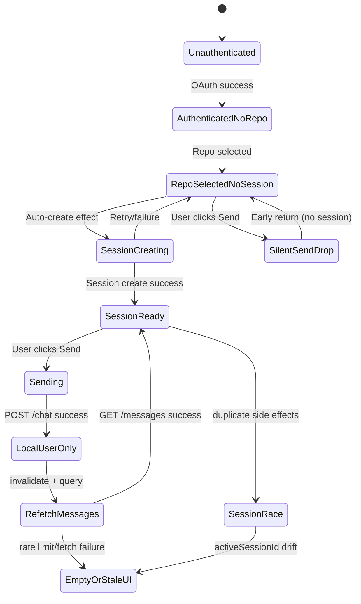
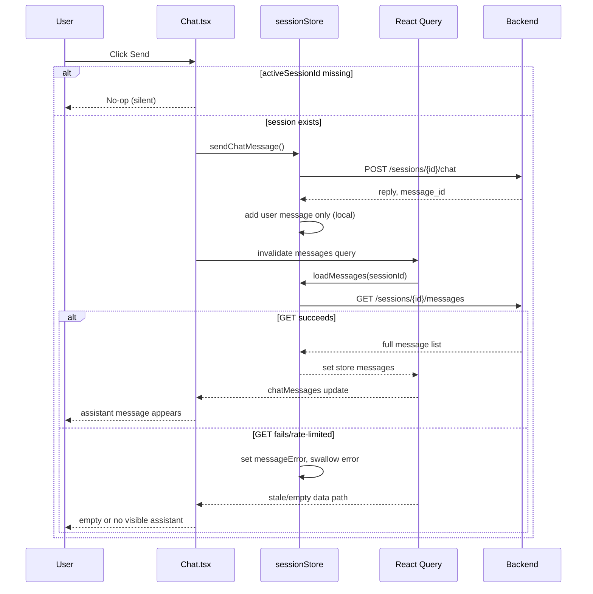
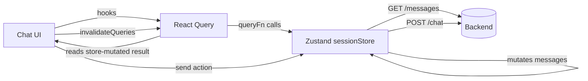

# Chat UI Empty Response Analysis Report

Date: 2026-02-17  
Repository: `YudaiV3`  
Scope: Frontend session/message flow after login and repository selection, with backend contract sanity check.

## 1. Executive Summary

The empty chat interface behavior is primarily a frontend state orchestration issue, not a backend message persistence issue. The key problems are:

1. Send can be triggered in a state where no active session exists, causing a silent no-op.
2. Session creation/validation side effects are distributed across multiple consumers, increasing race risk.
3. Assistant response rendering depends on a refetch path rather than deterministic local state update.
4. Errors in message loading are swallowed, making failures appear as empty UI.
5. Error signaling between store and UI is inconsistent (`null` returns vs thrown errors), so users often get no feedback.

Backend endpoints and models for storing/retrieving chat messages are consistent with frontend expectations.

## 2. Evidence Map (Key Code References)

- `src/components/Chat.tsx:336`  
  Early return in `handleSend` when `!activeSessionId`.
- `src/components/Chat.tsx:683`  
  Send button enabled based on selected repository, not session readiness.
- `src/hooks/useSessionManagement.ts:45`  
  Auto session creation side effect.
- `src/App.tsx:35` and `src/components/Chat.tsx:239`  
  `useSessionManagement()` consumed in multiple components.
- `src/stores/sessionStore.ts:889`  
  `sendChatMessage` adds only user message locally.
- `src/components/Chat.tsx:359`  
  Assistant output depends on invalidation/refetch of messages query.
- `src/hooks/useSessionQueries.ts:176`  
  Manual rate limiting can reject message query execution.
- `src/stores/sessionStore.ts:545`  
  `loadMessages` catches errors and does not rethrow.
- `src/stores/sessionStore.ts:905`  
  `sendChatMessage` catches and returns `null` on error.
- `backend/daifuUserAgent/ChatOps.py:228`  
  Backend persists both user and assistant messages.
- `backend/daifuUserAgent/session_service.py:224`  
  Backend returns session messages in chronological order.

## 3. Analysis of the 5 Findings

### 3.1 Point 1: Send enabled before session exists

Assessment: Correct and high impact.

- UI allows send with repo selected (`src/components/Chat.tsx:683`).
- Send handler no-ops when session missing (`src/components/Chat.tsx:337`).
- Result: user action disappears with no explicit error.

### 3.2 Point 2: Session creation races from distributed side effects

Assessment: Likely correct and medium/high risk.

- `useSessionManagement` owns side effects (create/validate session).
- Hook is consumed in both app shell and chat component.
- This pattern increases duplicate mutation and `activeSessionId` drift risk.

### 3.3 Point 3: Assistant display relies on refetch path

Assessment: Correct.

- POST `/chat` response is not translated into local assistant message state.
- Local state is updated with only the user message.
- Assistant bubble appears only if follow-up `/messages` query succeeds.

### 3.4 Point 4: Query/load failure can degrade to empty/stale UI

Assessment: Correct.

- Query layer can reject request as “rate limited.”
- Store catches load errors and suppresses throw.
- UI consumes `chatMessages = []` fallback and may show nothing meaningful.

### 3.5 Point 5: Error propagation model is inconsistent

Assessment: Correct.

- Store returns `null` on failure instead of throwing.
- UI catch block expects thrown errors for user-facing feedback.
- Many failures become silent unless special-cased manually.

## 4. Diagram A: Current App State Machine



### Explanation

This state machine highlights that `selectedRepository` is currently treated as sufficient readiness for sending, while actual send requires `activeSessionId`. The mismatch creates a reachable “silent drop” path. It also shows that assistant rendering is downstream of refetch success, introducing a fragile dependency.

### Proposed Fixes for Diagram A

1. Gate send on explicit readiness state (`sessionStatus === "ready"`), not repository selection alone.
2. Introduce explicit session status enum: `no_repo | creating_session | ready | sending | error`.
3. Replace no-op transitions with explicit error transitions and user feedback.
4. Centralize session side effects in one orchestrator to remove duplicate transition triggers.

## 5. Diagram B: Current Message Send Sequence



### Explanation

The sequence includes two critical breakpoints:

1. Precondition breakpoint: missing `activeSessionId` causes silent return.
2. Postcondition breakpoint: assistant visibility depends on secondary fetch success.

This design means a successful chat POST can still produce a “no response shown” UX if refetch fails.

### Proposed Fixes for Diagram B

1. Return a normalized object from POST that includes both user and assistant message payloads for immediate local append.
2. Keep refetch as reconciliation, not as primary rendering dependency.
3. Make store APIs throw typed errors, and let UI surface retry affordances.
4. Add operation id tracing (`requestId`) for send + refetch chain.

## 6. Diagram C: Current State Ownership and Data Flow



### Explanation

React Query and Zustand both participate in server state lifecycle. Query functions trigger store mutations, then query results are pulled from the store. This coupling makes ownership ambiguous and complicates error semantics and cache correctness.

### Proposed Fixes for Diagram C

1. Choose one owner for server state.
2. If React Query is the owner, keep Zustand for UI/session preferences only.
3. If Zustand is the owner, remove React Query from the message fetch path.
4. If keeping React Query, query functions should return fetched data directly and avoid indirect store side effects.
5. Define a single error contract across layers (`throw AppError` with code and user message).

## 7. Diagram D: Target Simplified Flow

```mermaid
flowchart TD
A[Repo selected] --> B[SessionOrchestrator creates/validates session once]
B --> C[sessionStatus = ready]
C --> D[User clicks Send]
D --> E[ChatService.send(sessionId, message)]
E --> F[Immediate local append: user + assistant placeholder]
E --> G[POST /chat]
G --> H[Replace placeholder with assistant response]
H --> I[Optional background reconcile: GET /messages]

G --> J[On error: transition to error state + retry CTA]
J --> C
```

### Explanation

The target path makes UI deterministic:

- Readiness is explicit and enforceable.
- Send has one command path with clear success/failure transitions.
- Assistant rendering does not depend on a second network call.

### Proposed Fixes for Diagram D

1. Add `SessionOrchestrator` singleton at app root for session lifecycle.
2. Add `ChatService.send()` command that validates readiness, writes optimistic state, and commits response or fails with typed error.
3. Keep reconcile fetch as eventual consistency, not user-visible dependency.
4. Add invariant checks in development builds.

## 8. Recommended Simplification Plan (Implementation Strategy)

### Phase 1: Correctness Guardrails

1. Disable send unless `sessionStatus === "ready"`.
2. Show explicit “Creating session...” and “Session error” banners in chat input area.
3. Replace silent returns with user-visible errors.
4. Remove manual request rate limiting from message query path.

### Phase 2: Ownership and Contract Cleanup

1. Decide ownership model (React Query or Zustand) and remove mixed server-state writes.
2. Normalize async API contracts so success always returns typed payload and failures always throw typed exceptions.
3. Ensure all fetch helpers either return data or throw; no `null` sentinel for errors.

### Phase 3: Prevent Regression by Design

1. Add a small state machine (XState or reducer) for session/chat readiness.
2. Add invariant test: `Send enabled -> activeSessionId exists`.
3. Add invariant test: `POST chat success -> assistant visible within same render cycle`.
4. Add invariant test: `Single session-create mutation in-flight per selected repo`.
5. Add E2E test for: login -> repo select -> send -> assistant visible.
6. Add structured logging around session id transitions and message query failures.

## 9. “Never Again” Engineering Rules for This Area

1. No silent no-op on user actions.
2. One owner for each state category (server state vs UI state).
3. One source of truth for readiness, enforced in UI controls.
4. One async error contract across all layers.
5. One orchestration boundary for session lifecycle side effects.

## 10. Expected Outcomes After Refactor

1. Users always receive visible feedback when send is unavailable or fails.
2. Assistant responses appear deterministically on successful chat POST.
3. Session race conditions are significantly reduced by centralized orchestration.
4. Debugging becomes faster due to consistent state ownership and logs.
5. Regression likelihood drops through invariant and E2E coverage.
