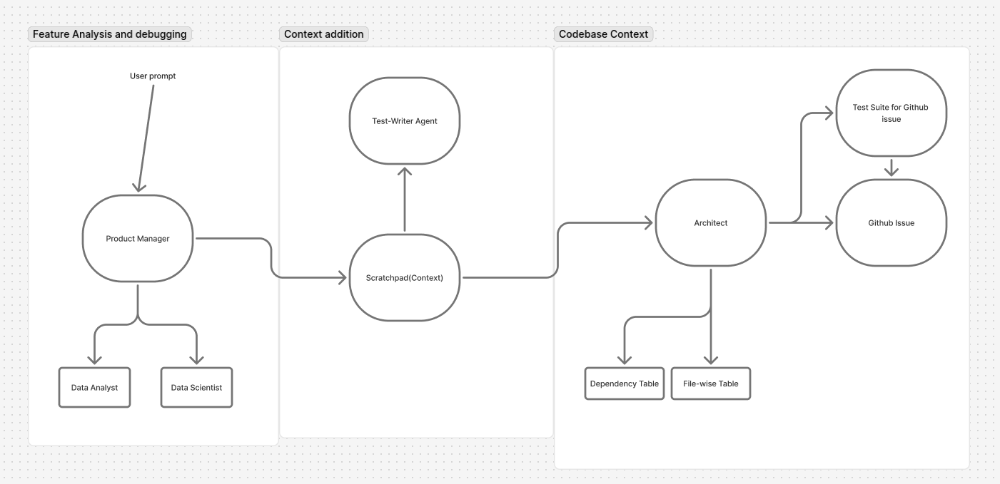

# YudaiV3

> **Agentic PRD-to-PR Generator for Product Managers, Vibe coders and Solo Builders and Founders**

---

## 🚀 What is YudaiV3?

**YudaiV3** is an agent-powered workspace for product managers and solo founders who want to turn raw context — like CSVs, scratchpad notes, and project insights — into **high-fidelity GitHub issues and pull requests**.

It automates the boring parts:  
- Upload data 📊  
- Analyse data and Add notes 📝  
- Generate context-rich issues ✅  
- Hand off specs and tests to coding agents 🤖  
- Human merges the final PR ✍️

---

## 🧩 Three-Agent Architecture

YudaiV3 runs on a **three-agent pipeline**:  
1. **PM Agent** — Parses your context (CSVs, notes, PDFs) and turns it into actionable insights.  
2. **Architect Agent** — Generates technical specs and unit tests based on the issue context.  
3. **Coder Agent** — Uses **OpenAI Codex** (or compatible models) to implement the actual pull request in your repo.

This way, insights flow **seamlessly** from raw data to reproducible, test-driven code.

---

## 🎯 Who is this for?

**Primary Users**
- Product managers and founders working with GitHub repos under ~100k LoC.
- People who can upload CSVs and write simple SQL slices.

**Secondary Users**
- Technical growth folks and data-savvy devs who need to link insights directly to executable work.

---

## 🗂️ How it works

1. **Connect your repo** – Link a GitHub project.
2. **Upload context** – PDFs, scratchpad notes, CSV data (up to 3 files, ≤1GB total).
3. **Generate insights** – Natural language → Pandas query → summarized answer.
4. **Create issues** – Turn those insights into rich GitHub issues automatically.
5. **Agent handoff** – PM → Architect → Coder (powered by OpenAI Codex) → human reviews & merges.
6. **Self-host mode** – Bring your own LLM API key if you want to run it privately.

---

## 🗺️ Current Roadmap (v0.1.0)

| Week | Milestone                                              |
| ---- | ------------------------------------------------------ |
| 1–2  | `yudai init` CLI + GUI setup wizard                    |
| 3–4  | CSV ingestion & schema merge                           |
| 5–6  | Insight engine prototype (NL → query → summary)        |
| 7–8  | Issue generator connected to GitHub                    |
| 9    | Multi-agent orchestration: PM → Architect → Coder      |
| 10   | Self-host mode + API key + telemetry toggle            |
| 11–12| Polish, early tester invites, landing page             |

---

## ⚙️ MVP Constraints

- Up to 3 CSVs per project.
- Unidirectional DAG for schema evolution.
- No auto-merge or rollback (human-in-the-loop).
- Cloud-first with optional local mode.

---

## 📜 License

This is an early-stage open build. License TBD.

---

**Happy shipping!**

=======
