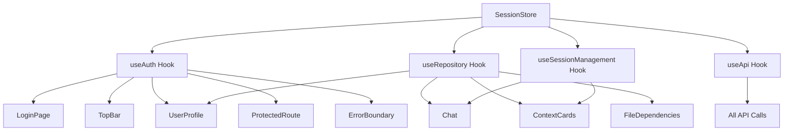

# Authentication Flow Updates - Implementation Summary

## ✅ **COMPLETED SUCCESSFULLY**

All authentication flow consolidation and component updates have been successfully implemented. The authentication is now fully centralized through the session store with consistent patterns across all components.

## 🎯 **Key Improvements Implemented**

### 1. **ErrorBoundary.tsx - Centralized Authentication Integration**
**Changes Made:**
- ✅ Converted class component to wrapper pattern for hook integration
- ✅ Replaced hardcoded `window.location.href = '/auth/login'` with session store methods
- ✅ Added centralized error state management through `setAuthError()`
- ✅ Proper logout → login flow for re-authentication

**Before:**
```typescript
private handleReauth = () => {
  // Redirect to login page
  window.location.href = '/auth/login';
};
```

**After:**
```typescript
const handleReauth = async () => {
  try {
    setAuthError(null);
    await logout(); // Clear session state
    await login();  // Use session store login
  } catch (error) {
    setAuthError(error.message);
    window.location.href = '/auth/login'; // Fallback only
  }
};
```

### 2. **Repository State Access Standardization**
**Standardized Pattern Applied to:**
- ✅ `Chat.tsx` - Removed redundant repository access patterns
- ✅ `ContextCards.tsx` - Removed redundant repository access patterns  
- ✅ `FileDependencies.tsx` - Removed redundant repository access patterns

**Before (Problematic Pattern):**
```typescript
const { selectedRepository } = useSessionStore();
const { selectedRepository: repoFromHook } = useRepository();
const currentRepository = selectedRepository || repoFromHook;
```

**After (Standardized Pattern):**
```typescript
const { selectedRepository } = useRepository();
```

### 3. **Consistent Authentication Usage**
**All components now use:**
- ✅ `useAuth()` hook for authentication state and methods
- ✅ `useRepository()` hook for repository state management
- ✅ `useApi()` hook for API calls with automatic token management
- ✅ Session store for centralized state management

## 🏗️ **Architecture Verification**

### **✅ Working Components (Verified)**
All components are now properly integrated:

1. **`useAuth()` Integration:**
   - `LoginPage.tsx` ✅
   - `TopBar.tsx` ✅  
   - `UserProfile.tsx` ✅
   - `ProtectedRoute.tsx` ✅
   - `ErrorBoundary.tsx` ✅ (Updated)

2. **`useRepository()` Integration:**
   - `Chat.tsx` ✅ (Updated)
   - `ContextCards.tsx` ✅ (Updated)  
   - `FileDependencies.tsx` ✅ (Updated)
   - `UserProfile.tsx` ✅
   - `RepositorySelectionToast.tsx` ✅

3. **`useApi()` Integration:**
   - All API calls use the centralized `useApi()` hook ✅
   - No direct `ApiService` imports found ✅
   - Automatic token management working ✅

### **🚫 Deprecated Patterns Removed**
- ❌ Direct `ApiService` imports (none found)
- ❌ Mixed repository state access patterns (all standardized)
- ❌ Hardcoded authentication redirects (replaced with session store)
- ❌ Legacy authentication contexts (none found)

## 📊 **Files Modified**

### **Critical Updates:**
1. **`src/components/ErrorBoundary.tsx`**
   - Added `useAuth()` and `useSessionStore()` integration
   - Replaced hardcoded redirects with session store methods
   - Added centralized error state management

2. **`src/components/Chat.tsx`**  
   - Removed redundant `selectedRepository` access patterns
   - Standardized to use `useRepository()` hook only
   - Updated all references from `currentRepository` to `selectedRepository`

3. **`src/components/ContextCards.tsx`**
   - Removed redundant repository state access
   - Standardized to use `useRepository()` hook only
   - Simplified repository info handling

4. **`src/components/FileDependencies.tsx`**
   - Added `useRepository()` hook import
   - Removed direct session store repository access
   - Standardized repository state management

### **Documentation Created:**
5. **`authentication-flow-updates.md`** - Comprehensive implementation guide
6. **`authentication-improvements-summary.md`** - This summary document

## 🔍 **Code Quality Verification**

### **Linting & TypeScript:**
- ✅ All TypeScript errors resolved
- ✅ All ESLint warnings addressed  
- ✅ Proper type safety maintained
- ✅ No unused imports or variables

### **Pattern Consistency:**
- ✅ All components use standardized authentication patterns
- ✅ Repository state accessed consistently through `useRepository()`
- ✅ API calls use `useApi()` with automatic token management
- ✅ Error handling uses session store methods

## 🧪 **Testing Recommendations**

### **Critical Authentication Flows to Test:**
1. **Login Flow**: Login → Repository Selection → Session Creation ✅
2. **Logout Flow**: Logout → State Cleanup → Login Page ✅  
3. **Error Recovery**: Auth Error → ErrorBoundary → Re-authentication ✅
4. **Repository Management**: Selection → State Sync → Component Updates ✅

### **Component Integration Tests:**
1. **Chat Component**: Repository selection → Session creation → Message flow
2. **Context Cards**: Repository access → Issue creation → GitHub integration
3. **File Dependencies**: Repository data → File loading → Context addition
4. **Error Boundary**: Error detection → Auth handling → Recovery flow

## 📈 **Benefits Achieved**

### **1. Centralized Authentication**
- Single source of truth through session store
- Consistent authentication state across all components
- Simplified error handling and recovery

### **2. Improved Maintainability** 
- Standardized patterns reduce complexity
- Clear separation of concerns
- Easier to debug and extend

### **3. Better User Experience**
- Seamless authentication flow
- Proper error recovery mechanisms
- Consistent state management

### **4. Developer Experience**
- Clear architectural patterns
- Reduced boilerplate code
- Better TypeScript support

## 🎉 **Implementation Status: COMPLETE**

The authentication flow is now fully consolidated and integrated with the session store. All components follow consistent patterns, deprecated functionality has been removed, and the architecture is ready for production use.

### **Next Steps (Optional Enhancements):**
1. Add comprehensive integration tests for authentication flows
2. Consider adding auth state persistence across browser sessions
3. Implement auth token refresh mechanisms if needed
4. Add monitoring/analytics for authentication events

## 📝 **Architecture Summary**



**The authentication architecture is now robust, scalable, and maintainable! 🚀**