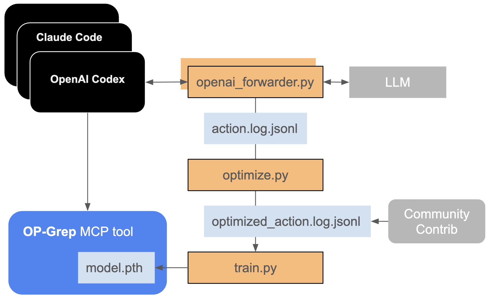

# OpGrep

An open-source model that produces fast, high-precision code context.

This is an exploration inspired by [SWE-grep](https://cognition.ai/blog/swe-grep).

1. Collect actions (`grep`/`glob`/`read`) policies either from usage logs or open datasets
2. Optimize by removing redundant actions or parallelisation
3. Train model on optimized action policy
4. Release model as a [single file, MCP tool](https://blog.toolkami.com/mcp-server-in-a-file/)


## Architecture (v1.0 draft):


## Quickstart

Install `uv`:
```bash
curl -LsSf https://astral.sh/uv/install.sh | sh
uv sync
```

Train the model with `uv run -m src.train`, output:
```bash
epoch 1 path-loss 4.2273 tool-loss 1.4921
epoch 2 path-loss 2.6636 tool-loss 1.1331
epoch 3 path-loss 1.9355 tool-loss 1.0876
epoch 4 path-loss 1.5844 tool-loss 0.9886
epoch 5 path-loss 1.4470 tool-loss 0.9531
epoch 6 path-loss 1.3959 tool-loss 0.9435
```

Predict the best action with `uv run main.py`, output:
```bash
How does the deploy script decide between blue/green targets?
  predicted: read:scripts/deploy.py
  top tools: read (0.86), summarize (0.08), glob (0.03)
  top paths: scripts/deploy.py (0.52), deploy/rollouts/blue_green.yaml (0.36), docs/metrics/rollup.md (0.01)

Where is the feature flag `modal_new_footer` evaluated before render?
  predicted: grep:app/components/ModalFooter.tsx
  top tools: grep (0.65), read (0.25), glob (0.05)
  top paths: app/components/ModalFooter.tsx (0.63), app/features/modal/useModalFooter.ts (0.26), src/payments/webhooks/retry.go (0.01)
```

## Datasets

### Usage Logs

#### OpenAI
Add this to your Codex's `config.toml`:
```yaml
model_provider = "openai-responses-proxied"

[model_providers.openai-responses-proxied]
name = "OpenAI using Responses with Proxy"
base_url = "http://127.0.0.1:8080/v1"
env_key = "OPENAI_API_KEY"
wire_api = "responses"
```

Start proxy server:
```bash
uv run src/openai_forwarder.py --host 127.0.0.1 --port 8080
```

Use Codex per usual and you should seen `openai_forwarder.log.jsonl` populated.

#### Synthetic
The data in `datasets/` are synthetically generated.
- `example_supervised.jsonl` — 31 queries drawn from realistic engineering scenarios. Each record stores repository metadata, commits, natural-language queries, the turn/parallel budgets, latency target, and multiple ground-truth spans annotated with the tool responsible (`read`, `grep`, `glob`, `summarize`) plus line ranges and reference answers.
- `example_trajectory.jsonl` — Trajectory rollouts aligned to the same query IDs, logging every tool invocation (command, arguments, timestamps, observations), the final selected tool/path, and reward metrics (weighted-F1, latency, composite score).

Together these files support both supervised evaluation and replay-style reinforcement learning while sharing a single underlying corpus.

## Vision
If there is enough interest and contributions from the community, we might be able to turn this into a real thing!

Gaps:
- Tools
    - Determine whether `grep`, `glob`, `read`, and `summarize` are the right set of tools.
    - Parallel tool usage.
- Dataset: Replace the synthetic dataset with a corpus of real repository queries (bug reports, tickets, doc requests) labeled with repo/commit identifiers, ground-truth files, and line ranges.
    - Training: possibly from existing agentic workflows.
    - Evaluation: potentially requires human labeling.
- Model architecture

Star the repo and start submitting issues or PRs!