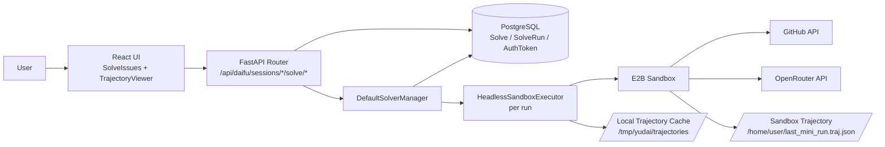
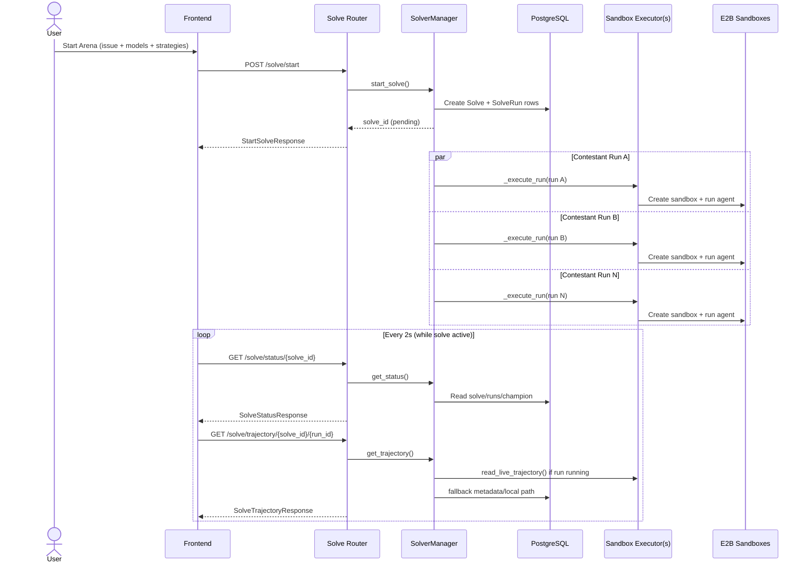
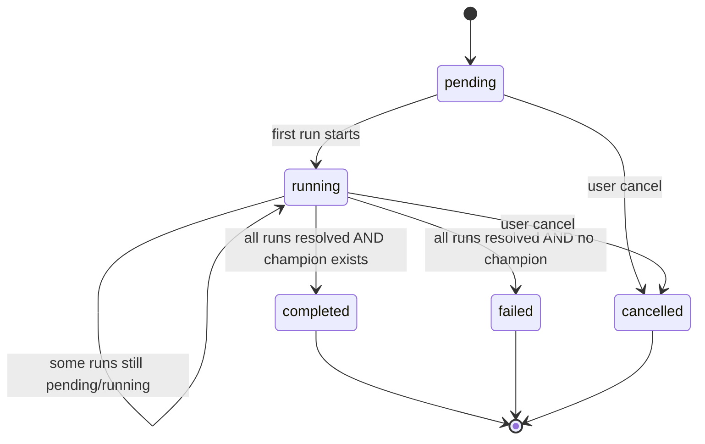
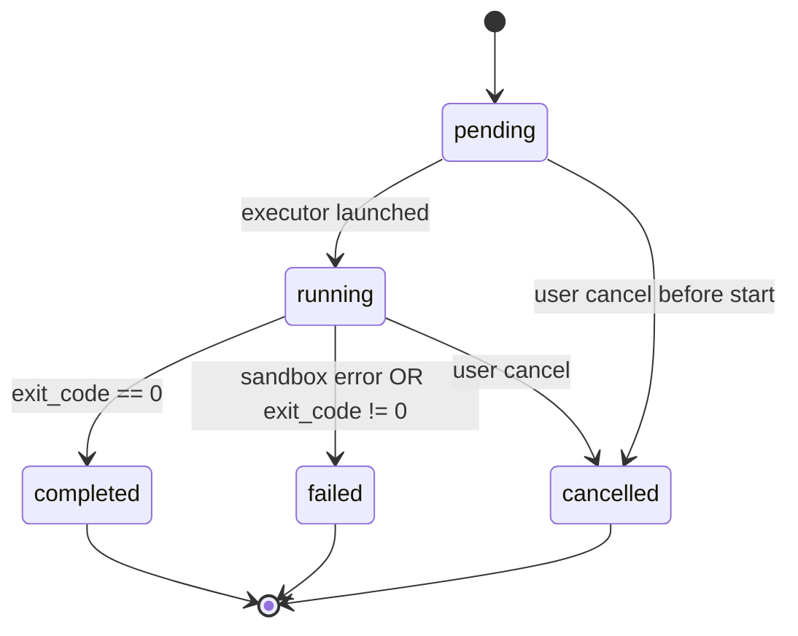
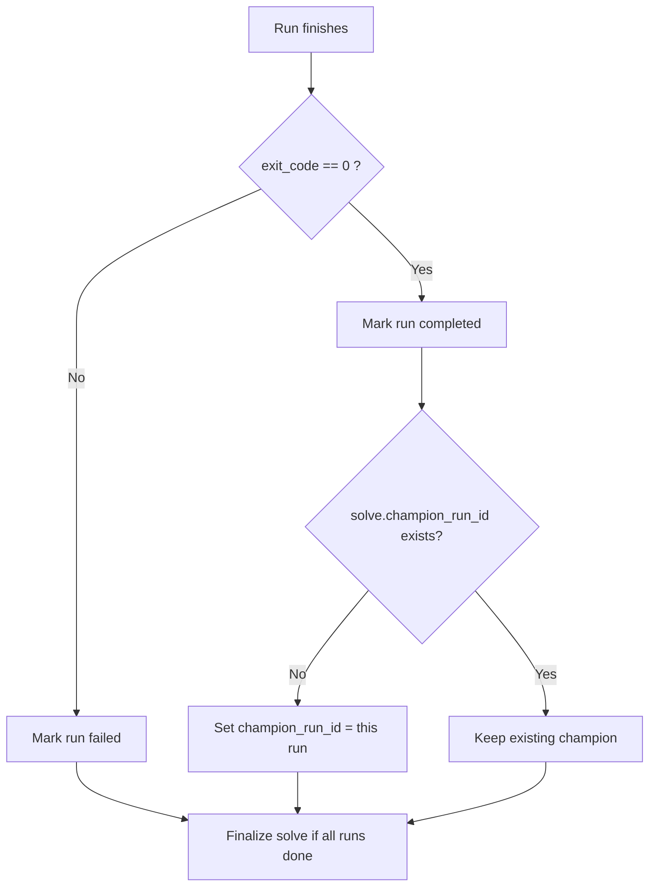
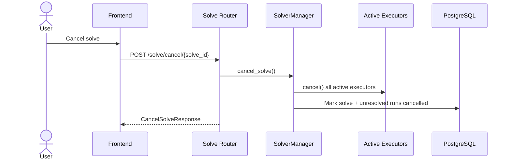
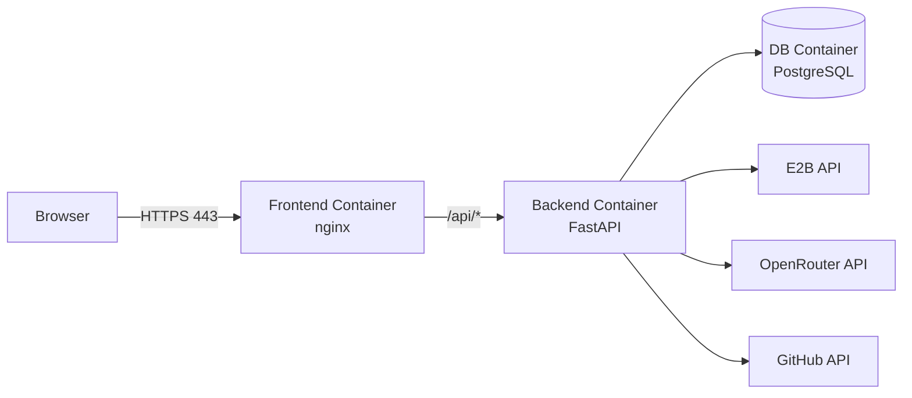

# MSWEA Arena MVP: Diagrams & State Flows

Last updated: 2026-02-12  
Scope: current MVP implementation (parallel contestants, winner selection, 2s trajectory polling, docker-compose prod deployment)

## 1) System Topology



## 2) Arena Start + Parallel Execution + Polling



## 3) Solve Session State Machine



## 4) SolveRun State Machine (per contestant)



## 5) Trajectory Source Resolution Flow

```mermaid
flowchart TD
    A[GET /solve/trajectory/{solve_id}/{run_id}] --> B{Run status is pending/running?}
    B -- No --> F{Local trajectory exists?}
    B -- Yes --> C{Live executor present?}
    C -- Yes --> D{Live read succeeds?}
    D -- Yes --> E[Return source=live_sandbox<br/>is_live=true]
    D -- No --> F
    C -- No --> F
    F -- Yes --> G[Load local file<br/>source=local_cache]
    F -- No --> H[Return empty trajectory<br/>source=none]
```

## 6) Champion Selection (MVP Heuristic)



## 7) Cancellation Flow



## 8) docker-compose.prod Runtime Flow



## 9) Operational Notes for Reading the Flows

- UI polling cadence for both solve status and trajectory is 2 seconds.
- Live trajectory can be partial while sandbox is still writing JSON.
- If live sandbox read is unavailable, API falls back to local cached trajectory.
- Arena is parallelized with bounded concurrency (`SOLVER_MAX_PARALLEL` and arena run caps).
- Winner logic in MVP is first successful run to set champion.
