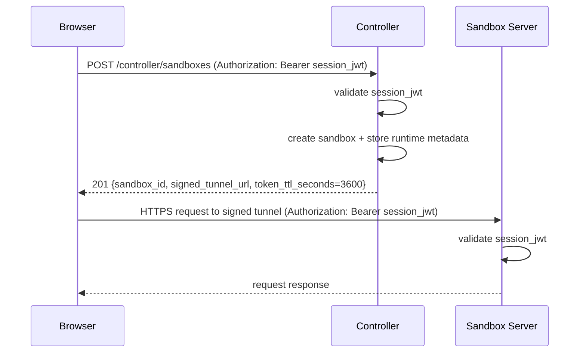
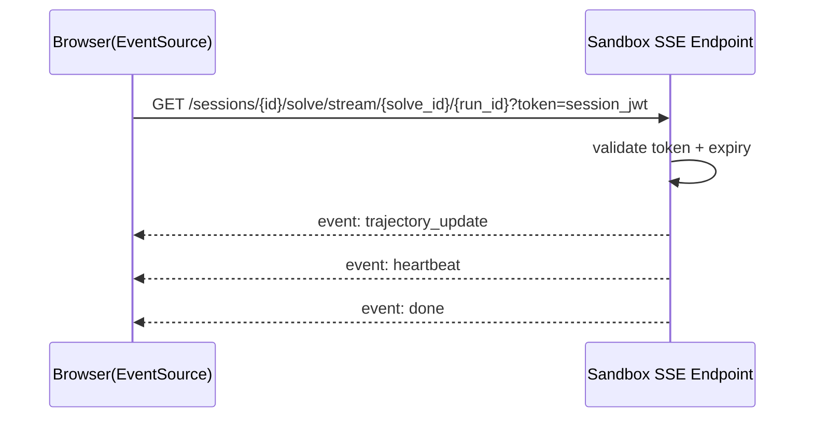

# Auth and Token Flow (Phase 0)

## Fixed Decisions

1. Tunnel auth reuses existing session JWT.
2. JWT tunnel TTL is 1 hour.
3. JWT is reusable until expiration.
4. Controller may return signed short-lived tunnel URL in addition to JWT auth.
5. SSE query token is accepted for EventSource compatibility.

## Browser -> Controller -> Sandbox (direct tunnel)

## SSE Stream Auth (query token)

