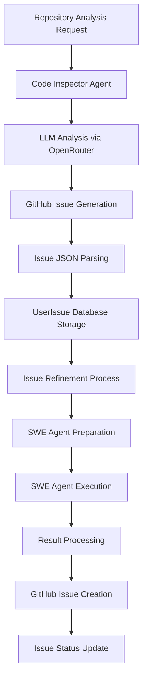

# Architecture Agent - SWE Agent Integration Plan

## Overview

This document outlines the architecture for integrating the Code Inspector Agent with SWE (Software Engineering) Agent processing in YudaiV3. The system provides an automated workflow from codebase analysis to issue generation to automated resolution.

## System Architecture



## Component Architecture

### 1. Code Inspector Agent (`backend/daifuUserAgent/architectAgent/`)

#### Core Components:
- **`promptTemplate.py`** ✅ - Prompt templates for different analysis types
- **`code_inspector_service.py`** ✅ - Main agent service class
- **`swe_agent_runner.py`** 🔄 - SWE agent execution wrapper
- **`github_issue_creator.py`** 🔄 - GitHub API integration for issue creation

#### File Structure:
```
backend/daifuUserAgent/architectAgent/
├── __init__.py
├── promptTemplate.py              ✅ Complete
├── code_inspector_service.py      ✅ Complete  
├── swe_agent_runner.py           🔄 Planned
├── github_issue_creator.py       🔄 Planned
├── config.py                     🔄 Planned
└── README.md                     🔄 Planned
```

### 2. Database Schema Updates

#### Enhanced UserIssue Model ✅
```python
class UserIssue(Base):
    # ... existing fields ...
    
    # SWE Agent integration
    swe_agent_status: Optional[str]     # not_started, running, completed, failed
    swe_execution_plan: Optional[str]   # JSON execution plan
    swe_result: Optional[str]           # Execution result
    complexity_score: Optional[str]     # S, M, L, XL
    estimated_hours: Optional[int]      # Effort estimation
```

### 3. SWE Agent Integration

#### SWE Agent Runner (`swe_agent_runner.py`) 🔄

**Purpose**: Execute SWE agent with prepared issues and manage the execution lifecycle.

**Key Features**:
- Interface with SWE agent framework
- Execution plan management
- Progress tracking and monitoring
- Error handling and recovery
- Result collection and processing

**Planned Implementation**:
```python
class SWEAgentRunner:
    """
    Manages SWE agent execution for automated issue resolution.
    """
    
    def execute_issue(
        self, 
        user_issue: UserIssue,
        execution_plan: Dict[str, Any],
        repository_path: str
    ) -> Dict[str, Any]:
        """Execute SWE agent on a prepared issue."""
        pass
    
    def monitor_execution(self, execution_id: str) -> Dict[str, Any]:
        """Monitor ongoing SWE agent execution."""
        pass
    
    def get_execution_results(self, execution_id: str) -> Dict[str, Any]:
        """Retrieve results from completed execution."""
        pass
```

#### GitHub Issue Creator (`github_issue_creator.py`) 🔄

**Purpose**: Create actual GitHub issues from resolved UserIssue objects.

**Key Features**:
- GitHub API integration
- Issue formatting and metadata
- Label and milestone management
- Pull request linking
- Issue tracking and updates

**Planned Implementation**:
```python
class GitHubIssueCreator:
    """
    Creates GitHub issues from UserIssue objects after SWE agent processing.
    """
    
    def create_github_issue(
        self,
        user_issue: UserIssue,
        repository: Repository,
        access_token: str
    ) -> Dict[str, Any]:
        """Create a GitHub issue from UserIssue."""
        pass
    
    def update_issue_status(
        self,
        user_issue: UserIssue,
        github_issue_data: Dict[str, Any]
    ):
        """Update UserIssue with GitHub issue information."""
        pass
```

## Workflow Implementation

### Phase 1: Code Analysis & Issue Generation ✅

1. **Repository Analysis**
   - `CodeInspectorService.analyze_repository_and_create_issues()`
   - LLM-powered codebase analysis
   - JSON issue generation and parsing
   - Database storage as UserIssue objects

2. **Issue Refinement**
   - Duplicate detection and removal
   - Quality validation and improvement
   - Priority and complexity scoring

### Phase 2: SWE Agent Preparation ✅

1. **Execution Plan Generation**
   - `CodeInspectorAgent.prepare_for_swe_agent()`
   - Detailed step-by-step resolution plan
   - Risk assessment and mitigation
   - Success criteria definition

2. **Issue Status Update**
   - Status: `pending` → `ready_for_swe`
   - Store execution plan in `swe_execution_plan` field

### Phase 3: SWE Agent Execution 🔄

1. **Execution Management**
   ```python
   # Planned workflow
   swe_runner = SWEAgentRunner()
   
   # Get issues ready for SWE processing
   ready_issues = CodeInspectorService.get_issues_ready_for_swe(db, repo_id)
   
   for issue in ready_issues:
       execution_plan = json.loads(issue.swe_execution_plan)
       result = swe_runner.execute_issue(issue, execution_plan, repo_path)
       
       # Update issue status and results
       issue.swe_agent_status = "completed"
       issue.swe_result = json.dumps(result)
   ```

2. **Progress Monitoring**
   - Real-time execution status updates
   - Error detection and handling
   - Partial result collection

### Phase 4: GitHub Integration 🔄

1. **Issue Creation**
   ```python
   # Planned workflow
   github_creator = GitHubIssueCreator()
   
   for issue in completed_issues:
       if issue.swe_agent_status == "completed":
           github_issue = github_creator.create_github_issue(
               user_issue=issue,
               repository=repository,
               access_token=user_token
           )
           
           issue.github_issue_url = github_issue['html_url']
           issue.github_issue_number = github_issue['number']
   ```

2. **Status Synchronization**
   - GitHub issue creation
   - Pull request linking (if applicable)
   - Status updates and notifications

## Configuration Management

### Agent Configuration (`config.py`) 🔄

**Purpose**: Centralized configuration for all agent components.

```python
# Planned configuration structure
class AgentConfig:
    # OpenRouter API
    OPENROUTER_API_KEY: str
    DEFAULT_MODEL: str = "deepseek/deepseek-r1-0528:free"
    
    # SWE Agent
    SWE_AGENT_PATH: str
    SWE_WORKSPACE_PATH: str
    SWE_TIMEOUT: int = 3600  # 1 hour
    
    # GitHub API
    GITHUB_API_BASE: str = "https://api.github.com"
    
    # Analysis settings
    MAX_ISSUES_PER_ANALYSIS: int = 20
    ANALYSIS_TIMEOUT: int = 300  # 5 minutes
```

## API Integration Points

### Internal Service APIs

1. **Repository Analysis Trigger**
   ```python
   # Called from existing services
   issues = CodeInspectorService.analyze_repository_and_create_issues(
       db=db,
       repository_id=repo_id,
       user_id=user_id,
       analysis_type="comprehensive",
       focus_areas=["security", "performance"]
   )
   ```

2. **SWE Agent Execution**
   ```python
   # Batch processing endpoint
   execution_plan = CodeInspectorService.prepare_issue_for_swe_agent(
       db=db,
       issue_id=issue_id
   )
   ```

### External Integration Points

1. **GitHub API**: Issue creation, PR management, status updates
2. **SWE Agent Framework**: Execution interface, result collection
3. **Repository Processing**: File analysis, dependency mapping

## Data Flow

### Issue Lifecycle States

```
pending → ready_for_swe → swe_processing → completed → github_created
     ↓           ↓              ↓              ↓            ↓
   analysis → preparation → execution → resolution → publication
```

### Database Interactions

1. **Read Operations**:
   - Repository metadata and file structure
   - Existing issues for duplicate detection
   - User authentication and permissions

2. **Write Operations**:
   - UserIssue creation and updates
   - Status and progress tracking
   - Execution results and GitHub metadata

## Security Considerations

1. **API Key Management**:
   - Secure storage of OpenRouter and GitHub tokens
   - User-specific access token handling
   - Rate limiting and quota management

2. **Repository Access**:
   - Permission validation for repository analysis
   - Secure repository cloning and access
   - Cleanup of temporary files and workspaces

3. **Execution Isolation**:
   - Sandboxed SWE agent execution
   - Resource limits and timeouts
   - Error containment and recovery

## Monitoring and Observability

1. **Execution Metrics**:
   - Analysis completion rates
   - Issue generation statistics
   - SWE agent success rates

2. **Performance Monitoring**:
   - API response times
   - Token usage and costs
   - Resource utilization

3. **Error Tracking**:
   - Failed analysis attempts
   - SWE agent execution errors
   - GitHub API failures

## Future Enhancements

1. **Multi-Agent Orchestration**:
   - Parallel issue processing
   - Agent specialization (security, performance, etc.)
   - Load balancing and resource management

2. **Advanced Issue Management**:
   - Issue dependency resolution
   - Incremental updates and patches
   - Quality scoring and ranking

3. **Integration Expansions**:
   - Multiple VCS platforms (GitLab, Bitbucket)
   - CI/CD pipeline integration
   - Code review automation

## Implementation Priority

### Immediate (Next Sprint)
1. ✅ Code Inspector Agent implementation
2. ✅ Prompt template system
3. ✅ Database schema updates

### Short-term (2-4 weeks)
1. 🔄 SWE Agent Runner implementation
2. 🔄 GitHub Issue Creator
3. 🔄 Configuration management
4. 🔄 Basic execution workflow

### Medium-term (1-2 months)
1. 🔄 Advanced monitoring and observability
2. 🔄 Error handling and recovery
3. 🔄 Performance optimization
4. 🔄 Integration testing

### Long-term (3+ months)
1. 🔄 Multi-agent orchestration
2. 🔄 Advanced issue management
3. 🔄 Platform integrations
4. 🔄 ML-powered improvements

---

## Status Legend
- ✅ **Complete**: Fully implemented and tested
- 🔄 **Planned**: Designed but not yet implemented  
- ❌ **Blocked**: Requires external dependencies or decisions

This architecture provides a robust foundation for automated code analysis and issue resolution, integrating seamlessly with the existing YudaiV3 infrastructure while maintaining modularity and extensibility for future enhancements.
