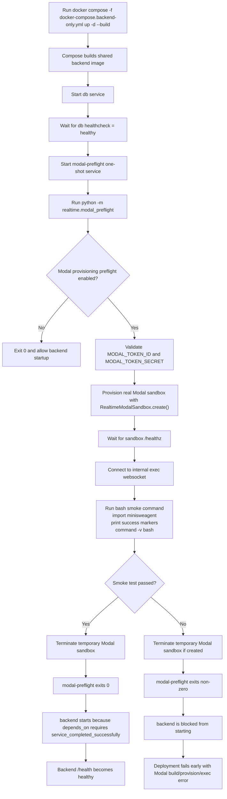

# Vercel Frontend + Docker Compose Backend Deployment

This guide uses a single production architecture:
- **Frontend**: Vercel (from `src/`)
- **Backend**: Docker Compose on your server
- **API routing**: Frontend calls backend directly via `https://api.yudai.app`

---

## Deployment Architecture

| Layer | Endpoint | Notes |
|------|----------|-------|
| Frontend | `https://yudai.app` | Hosted on Vercel |
| Backend API | `https://api.yudai.app` | Public HTTPS endpoint to your backend host |

Important:
1. Keep `src/vercel.json` free of `/api` rewrites to raw IP addresses.
2. Set `VITE_API_BASE_URL=https://api.yudai.app` in Vercel production env vars.
3. Set backend `BACKEND_URL=https://api.yudai.app`.
4. Backend serves canonical routes only (no `/api/*` compatibility aliases).
5. Do not use `VITE_WS_BASE_URL=ws://...` in production. Leave it unset, or set it to `https://api.yudai.app` if you need an explicit override.

---

## Step 1: Prepare Environment

```bash
# From project root
cp .env.deploy.template .env.deploy
cp .env.prod backend/.env.prod
```

Set these values in `backend/.env.prod`:
- `ALLOW_ORIGINS=https://yudai.app`
- `ALLOW_ORIGIN_REGEX=^https://.*\.vercel\.app$`
- `FRONTEND_URL=https://yudai.app`
- `BACKEND_URL=https://api.yudai.app`
- `CONTROLLER_BASE_URL=https://api.yudai.app`
- `GITHUB_REDIRECT_URI=https://api.yudai.app/auth/callback`
- `REALTIME_MODAL_PROVISIONING_ENABLED=true`
- `MODAL_TOKEN_ID=...`
- `MODAL_TOKEN_SECRET=...`
- `CONTROLLER_INTERNAL_WS_SECRET=...`

Optional:
- `MODAL_SANDBOX_PREFLIGHT_ENABLED=true`
  Keep this enabled in production. Only disable it for local debugging when you explicitly do not want Compose to validate Modal sandbox provisioning.

---

## Step 2: Deploy Backend

```bash
# From project root
docker compose -f docker-compose.backend-only.yml up -d --build
```

Expected behavior:
- Compose builds the shared backend image once.
- `db` must become healthy first.
- `modal-preflight` then provisions a real temporary Modal sandbox and runs the smoke test.
- `backend` starts only after `modal-preflight` exits successfully.

### Modal Sandbox Test Flow During Compose Deploy



What this validates:
- Modal image build succeeds with the same production sandbox image used at runtime.
- Sandbox provisioning succeeds in Modal.
- The sandbox server boots and answers `/healthz`.
- Internal bash command execution works through the controller-style websocket path.

To rerun only the Modal preflight:

```bash
docker compose -f docker-compose.backend-only.yml up \
  --abort-on-container-exit \
  --exit-code-from modal-preflight \
  modal-preflight
```

Check status:

```bash
docker compose -f docker-compose.backend-only.yml ps
docker compose -f docker-compose.backend-only.yml logs -f modal-preflight
docker compose -f docker-compose.backend-only.yml logs -f backend
curl http://localhost:8000/health
```

---

## Step 3: Deploy Frontend on Vercel

```bash
cd src
vercel --prod
```

Set Vercel production env vars:

```bash
VITE_API_BASE_URL=https://api.yudai.app
VITE_REALTIME_CONTROLLER_SPLIT_ENABLED=true
VITE_REALTIME_CONTROLLER_PROXY_ENABLED=true
VITE_REALTIME_WS_UNIFIED_ENABLED=true
```

If Vercel already has `VITE_WS_BASE_URL` saved as `ws://...` or a raw IP, delete it from the production environment or replace it with `https://api.yudai.app` before redeploying.

CLI alternative:

```bash
cd src
vercel env rm VITE_WS_BASE_URL production
vercel env add VITE_API_BASE_URL production
# Enter: https://api.yudai.app
vercel --prod
```

---

## Step 4: Configure DNS

Add DNS records:

| Record | Type | Value |
|--------|------|-------|
| `yudai.app` | A | 76.76.21.21 |
| `api.yudai.app` | A | YOUR_SERVER_IP |

---

## Quick Deploy

```bash
./scripts/deploy.sh \
  --backend-domain api.yudai.app \
  --frontend-domain yudai.app
```

`./scripts/deploy.sh` also runs the Modal preflight before replacing the running backend, so a Modal build/provisioning failure stops the deploy before the backend service is restarted.

With Vercel token:

```bash
./scripts/deploy.sh \
  --backend-domain api.yudai.app \
  --frontend-domain yudai.app \
  --vercel-token your_vercel_token
```

---

## Validation Checklist

```bash
# Backend public health endpoint
curl https://api.yudai.app/health

# Frontend
curl https://yudai.app
```

For WebSocket endpoints:

```bash
npm install -g wscat
wscat -c wss://api.yudai.app/controller/sessions/test-session/ws/unified?token=test-token
```

---

## Troubleshooting

Backend checks:

```bash
docker logs yudai-be
docker compose -f docker-compose.backend-only.yml logs -f modal-preflight
docker compose -f docker-compose.backend-only.yml restart backend
```

Common issues:
1. `403`/CORS: ensure `ALLOW_ORIGINS` and `ALLOW_ORIGIN_REGEX` are set correctly.
2. OAuth callback mismatch: ensure `GITHUB_REDIRECT_URI=https://api.yudai.app/auth/callback`.
3. Frontend calling wrong host: verify Vercel `VITE_API_BASE_URL=https://api.yudai.app`.
4. Mixed content websocket errors: remove any stale `VITE_WS_BASE_URL=ws://...` from Vercel and redeploy.
5. `modal-preflight` exits immediately: check `MODAL_TOKEN_ID`, `MODAL_TOKEN_SECRET`, and `REALTIME_MODAL_PROVISIONING_ENABLED`.
6. Modal image build fails on solver dependencies: inspect `docker compose ... logs modal-preflight`; the failure is usually in the Modal image layer, not the Docker backend container.
7. Preflight times out waiting for `/healthz`: inspect backend code baked into the Modal image and confirm the sandbox server can boot with the current env.
8. Preflight fails on internal exec: verify `CONTROLLER_INTERNAL_WS_SECRET` is set consistently and that the sandbox websocket smoke command can run `bash`.
