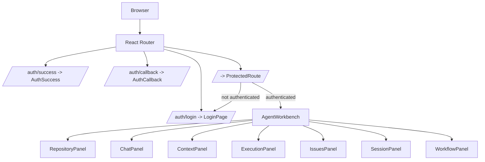
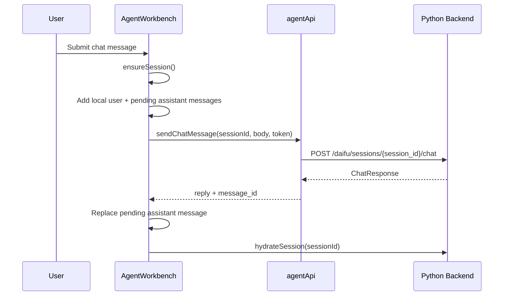
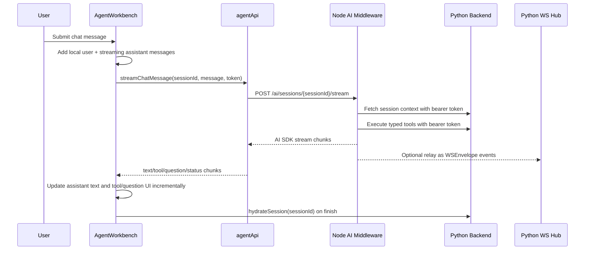

# Frontend Architecture

This document describes the current frontend implementation in `src/` and the frontend work still needed to adopt the AI SDK chat path tracked by GitHub issue #192.

## TL;DR

- The active protected route is `src/components/AgentWorkbench.tsx`.
- `AgentWorkbench` is currently a self-contained workspace shell. It does not mount the older `TopBar`, `SessionOrchestrator`, `Chat`, `SolveIssues`, or `TrajectoryViewer` shell.
- The current active chat path is HTTP: `AgentWorkbench -> agentApi.sendChatMessage() -> POST /daifu/sessions/{session_id}/chat`.
- The current active execution path is HTTP: `AgentWorkbench -> agentApi.startExecution() -> POST /daifu/sessions/{session_id}/execution`.
- The current active workbench hydrates messages, context cards, session issues, execution status, and trajectory summaries over HTTP after session activity.
- `useSessionWebSocket` and `sessionStore` still contain unified WebSocket chat/trajectory support, but that path is not wired into the active root route today.
- There is no frontend AI SDK stream client yet. No `src` API config points to `/ai/sessions/{sessionId}/stream`, and `AgentWorkbench` does not consume an AI SDK data stream.

## Active Route Structure

`src/App.tsx` owns routing and auth bootstrapping.



`App` also:

- calls `initializeAuth()` on mount
- clears frontend session state when the auth token changes
- resets the stored active tab to `chat` when the token changes
- clears session state after 10 minutes while authenticated
- wraps routes in `SessionErrorBoundary`

## Active Workbench

`src/components/AgentWorkbench.tsx` is the current product surface.

It owns local component state for:

- selected repository and branch
- repository search
- loaded branch list
- loaded GitHub issues
- current Daifu session
- chat messages
- context cards
- pending user questions
- session issues
- execution status
- trajectory summaries
- active workbench view
- transient notices

The workbench views are declared in `WORKSPACE_TABS`:

| Internal view | Label | Panel | Purpose |
| --- | --- | --- | --- |
| `chat` | `Chat` | `ChatPanel` | Send messages to the Daifu session and answer pending questions |
| `context` | `Context` | `ContextPanel` | Show context cards loaded from the backend |
| `execution` | `Runs` | `ExecutionPanel` | Start/cancel Architect, Tester, or Coder runs and show trajectory summaries |
| `issues` | `Issues` | `IssuesPanel` | Show session-created issues or repository issues |

This is separate from the older global `TabType` values in `sessionStore`:

```ts
type WorkspaceView = 'chat' | 'context' | 'execution' | 'issues';
type ExecutionMode = 'architect' | 'tester' | 'coder';
```

## Active Data Flow

### Auth

Auth still goes through the Python backend:

```text
LoginPage -> authStore.login() -> GET /auth/api/login -> GitHub OAuth
GitHub OAuth -> backend callback -> /auth/success?session_token=...
AuthSuccess -> authStore.setAuthFromCallback(...) -> navigate("/")
App -> initializeAuth() -> GET /auth/api/user, only when a token exists
```

The bearer token remains in `authStore.sessionToken` and is passed to API calls as an `Authorization: Bearer ...` header.

### Repository And Session

`AgentWorkbench` loads repository data directly through `agentApi`:

```text
agentApi.listRepositories()
agentApi.listBranches(owner, repo)
agentApi.listRepositoryIssues(owner, repo)
```

When the user starts a session, `AgentWorkbench` calls:

```text
agentApi.createSession(...)
POST /daifu/sessions
```

After session activity, `hydrateSession(sessionId)` refreshes the active workspace with parallel HTTP calls:

```text
GET /daifu/sessions/{session_id}
GET /daifu/sessions/{session_id}/context-cards
GET /daifu/sessions/{session_id}/issues
GET /daifu/sessions/{session_id}/execution
GET /daifu/sessions/{session_id}/trajectories
```

### Chat

The active chat submit handler is `handleSendMessage()` in `AgentWorkbench`.

Current behavior:

1. Ensure a session exists.
2. Add a local user message.
3. Add a local pending assistant message with `Thinking...`.
4. Call `agentApi.sendChatMessage()`.
5. Replace the pending assistant message with the final backend response.
6. Hydrate the session again from the backend.



There is no token-level streaming in the active workbench today. The assistant message updates only after the HTTP response completes.

### Questions

Pending questions are returned by session hydration as `pending_questions`.

`AgentWorkbench` renders them through `UserQuestionPrompt` and answers them with:

```text
agentApi.answerQuestion()
POST /daifu/sessions/{session_id}/questions/{question_id}/answer
```

After answering, `refreshAfterDaifuActivity()` polls session hydration briefly while the backend gathering state is active.

### Execution

The active execution panel supports explicit mode selection:

- `architect`
- `tester`
- `coder`

Starting a run calls:

```text
agentApi.startExecution(sessionId, { force_mode, objective }, token)
POST /daifu/sessions/{session_id}/execution
```

Cancelling calls:

```text
agentApi.cancelExecution(sessionId, token)
POST /daifu/sessions/{session_id}/execution/cancel
```

The active panel shows trajectory summaries from:

```text
GET /daifu/sessions/{session_id}/trajectories
```

It does not currently open the unified WebSocket for live trajectory streaming.

## API Client

`src/services/agentApi.ts` is the active contract client used by `AgentWorkbench`.

It provides:

| Method | Backend endpoint |
| --- | --- |
| `listRepositories()` | `/daifu/github/repositories` |
| `listBranches()` | `/daifu/github/repositories/{owner}/{repo}/branches` |
| `listRepositoryIssues()` | `/daifu/github/repositories/{owner}/{repo}/issues` |
| `createSession()` | `/daifu/sessions` |
| `getSessionContext()` | `/daifu/sessions/{session_id}` |
| `sendChatMessage()` | `/daifu/sessions/{session_id}/chat` |
| `answerQuestion()` | `/daifu/sessions/{session_id}/questions/{question_id}/answer` |
| `listContextCards()` | `/daifu/sessions/{session_id}/context-cards` |
| `listSessionIssues()` | `/daifu/sessions/{session_id}/issues` |
| `createIssuePreview()` | `/daifu/sessions/{session_id}/issues/create-with-context` |
| `getExecutionStatus()` | `/daifu/sessions/{session_id}/execution` |
| `startExecution()` | `/daifu/sessions/{session_id}/execution` |
| `cancelExecution()` | `/daifu/sessions/{session_id}/execution/cancel` |
| `ensureRuntime()` | `/controller/sessions/{session_id}/runtime` |
| `listTrajectories()` | `/daifu/sessions/{session_id}/trajectories` |

`src/config/api.ts` defines the Python backend base URL through `VITE_API_BASE_URL`. Production defaults to `https://api.yudai.app`; local development defaults to `/api`.

There is no AI middleware base URL or stream endpoint in `src/config/api.ts` yet.

## Legacy And Secondary Frontend Paths

Several older frontend modules still exist and may be useful, but they are not mounted by the active root route.

| File | Current status |
| --- | --- |
| `src/stores/sessionStore.ts` | Zustand store for the older tabbed shell. Includes HTTP session APIs and a WebSocket-first chat path behind realtime flags. Not used by `AgentWorkbench`. |
| `src/components/TopBar.tsx` | Older tab navigation for `chat`, `context`, `ideas`, and `solve`. Not mounted by `App`. |
| `src/components/SessionOrchestrator.tsx` | Older side-effect manager for auto session creation/hydration. Not mounted by `App`. |
| `src/components/Chat.tsx` | Older chat component. Includes local regex parsing of `Button{"..."}` actions. Not mounted by `App`. |
| `src/components/SolveIssues.tsx` | Older execution launcher. Not mounted by `App`. |
| `src/components/TrajectoryViewer.tsx` | Uses `useSessionWebSocket` for live unified WebSocket events. Not mounted by `AgentWorkbench`. |
| `src/hooks/useSessionWebSocket.ts` | WebSocket hook that understands `status`, `trajectory_update`, `llm_stream`, `sandbox_stream`, `mode_event`, `state_event`, `tool_call`, `agent_question`, `error`, and `done`. Available, but not used by active workbench. |

The old `ideas` tab key means `Trajectory` in those legacy components. The active `AgentWorkbench` does not use `ideas`.

## Existing Realtime Support

`src/hooks/useSessionWebSocket.ts` can connect to:

```text
/controller/sessions/{sessionId}/ws/unified
```

It already handles these event types:

- `llm_stream`
- `tool_call`
- `agent_question`
- `trajectory_update`
- `sandbox_stream`
- `mode_event`
- `state_event`
- `status`
- `heartbeat`
- `error`
- `done`

`src/stores/sessionStore.ts` also has `sendChatMessageViaUnifiedWs()` and can use WebSocket chat when either `VITE_REALTIME_WS_CHAT_ENABLED` or `VITE_REALTIME_WS_UNIFIED_ENABLED` is true.

That support is currently outside the active `AgentWorkbench` path.

## AI SDK Adoption Target

Issue #192 proposes moving Daifu chat generation out of the Python regex pipeline and into a Node/Vercel AI SDK middleware layer.

The target frontend shape should be:



Important frontend boundary:

- The frontend should send the user token in the `Authorization` header.
- The frontend should not put bearer tokens in the request body or query string.
- The Node middleware should forward the bearer token to Python so Python keeps enforcing `get_current_user` on every context and tool request.

## Pending Frontend Tasks For AI SDK Adoption

### 1. Add AI middleware configuration

Add an AI middleware base URL and endpoint constants.

Likely files:

- `src/config/api.ts`
- `src/tests/frontend/apiConfig.test.ts`

Suggested shape:

```ts
export const AI_API_BASE = resolveAiApiBase(import.meta.env.VITE_AI_API_BASE_URL);

export const API = {
  // existing Python backend config
  AI: {
    CHAT_STREAM: `${AI_API_BASE}/ai/sessions/{sessionId}/stream`,
  },
};
```

The exact endpoint path should match the middleware implementation, but the frontend should keep it centralized.

### 2. Add a typed stream client to `agentApi`

Add a new method next to `sendChatMessage()` in `src/services/agentApi.ts`.

The method should:

- `POST` to the Node AI middleware stream endpoint
- pass auth as `Authorization: Bearer ${token}`
- send `message`, `session_id`, repository info, and selected context card ids as JSON
- parse the middleware stream format
- expose callbacks for text, status, tool calls, questions, errors, and final completion
- return a final response shape that can still be reconciled with backend hydration

Do not replace `sendChatMessage()` immediately. Keep the current Python chat call as a fallback until AI SDK streaming is proven.

### 3. Wire `AgentWorkbench.handleSendMessage()` to streaming

Update `AgentWorkbench` so chat can use the new stream client.

Current behavior:

```text
Pending assistant says "Thinking..." until REST completes.
```

Target behavior:

```text
Pending assistant starts empty.
Each AI SDK text chunk appends to that assistant message.
Tool/status/question chunks update side UI as they arrive.
Final chunk clears pending state and triggers hydrateSession(sessionId).
```

This is the main frontend adoption point because `AgentWorkbench` is the active root experience.

### 4. Represent AI SDK events in frontend types

Add or reuse typed event shapes for the stream chunks.

Likely files:

- `src/types/apiContract.ts`
- `src/types/sessionTypes.ts`
- `src/services/agentApi.ts`

The frontend needs types for at least:

- text chunks
- final text
- tool calls
- tool results
- clarification questions
- action buttons
- status updates
- errors

These should align with the Zod response schema used by the middleware, not with regex-parsed text conventions.

### 5. Replace regex-derived actions in the active path

The old `Chat.tsx` parses button actions with:

```ts
const BUTTON_ACTION_REGEX = /Button\{\s*"([^"]+)"\s*\}/gi;
```

That component is not active today, but this pattern should not be carried into the AI SDK path.

For the active workbench, action buttons should come from typed AI SDK output fields, not text parsing.

### 6. Decide how live events enter the workbench

There are two viable frontend paths:

1. Consume the AI middleware response stream directly in `agentApi.streamChatMessage()`.
2. Reuse `useSessionWebSocket` after Node relays AI SDK chunks into the Python `SessionWebSocketHub`.

The current active workbench uses neither. Pick one primary path before implementation.

Recommendation for the frontend:

- use the AI middleware response stream for the chat message currently being sent
- continue using Python hydration as the source of truth after completion
- wire `useSessionWebSocket` into `AgentWorkbench` separately if live trajectory/mode events are required in the active execution panel

### 7. Keep Python execution endpoints as the frontend contract

The frontend should not directly execute AI SDK tools.

AI SDK tools should run inside Node middleware and call Python endpoints with the bearer token. The frontend should continue to treat these as backend side effects that appear through:

- stream tool/status chunks
- refreshed session messages
- refreshed session issues
- refreshed execution status
- refreshed trajectory summaries

### 8. Add tests around the cutover

Focused frontend tests should cover:

- API config builds the AI middleware endpoint correctly
- `agentApi.streamChatMessage()` sends auth in the header
- stream chunks update the pending assistant message incrementally
- stream errors turn the pending message into an error state or restore the draft
- final completion calls session hydration
- fallback to `sendChatMessage()` remains available while the feature flag is disabled

## Suggested Frontend Cutover Plan

1. Add `VITE_AI_API_BASE_URL`, `API.AI.CHAT_STREAM`, and tests.
2. Add `agentApi.streamChatMessage()` with a small normalized chunk interface.
3. Add an `aiSdkChatEnabled` flag, defaulting off.
4. Update `AgentWorkbench.handleSendMessage()` to use streaming when the flag is on and REST when it is off.
5. Render typed action buttons/questions/tool statuses from stream chunks.
6. Hydrate the session after every final or failed stream.
7. Remove or quarantine regex-derived chat action parsing from any path that remains user-facing.
8. Once production verifies the stream path, remove the Python chat fallback from the active workbench.

## Current Architectural Mismatches

These are the parts most likely to confuse someone reading `src`:

1. The active route uses `AgentWorkbench`, but several older tabbed-shell files still exist.
2. The active workbench uses local component state, while `sessionStore` still contains a richer older global session model.
3. The active workbench uses HTTP hydration for execution and trajectory summaries, while `useSessionWebSocket` supports live unified WebSocket events but is not mounted.
4. The older `Chat.tsx` still has regex-derived action parsing, which conflicts with the AI SDK typed-schema direction.
5. `src/config/api.ts` only knows about the Python backend today; there is no Node AI middleware frontend contract yet.

## Recommended Mental Model

- `authStore` = authenticated user and bearer token
- `AgentWorkbench` = active workspace shell and local UI state owner
- `agentApi` = active HTTP contract client
- Python backend = auth, sessions, persistence, GitHub, execution, and current chat
- Node AI middleware = planned AI SDK chat/agent layer
- `useSessionWebSocket` = available realtime foundation, not active in the current root workbench
