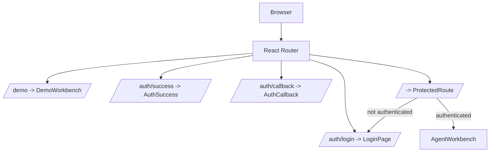
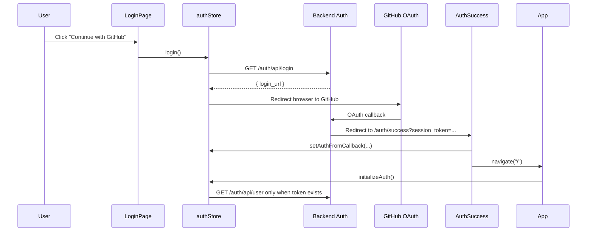
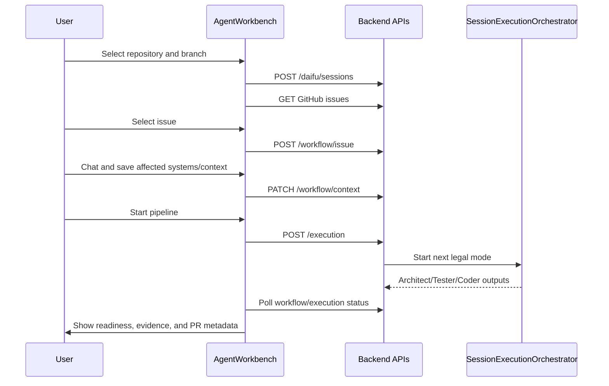

# Frontend Architecture

Last updated: 2026-04-28

This document describes the current `src/` frontend: route structure, the visual system, the public demo surface, and how the authenticated workbench drives issue-to-PR repository automation.

## TL;DR

- `docs/design-doc.md` is the visual source of truth.
- `src/components/LoginPage.tsx` is the canonical public landing page and uses the real logo from `/assets/baseLogo.png` plus the embedded product video from `/videos/yudai-enterprise-intro.mp4`.
- `src/App.tsx` registers a public `/demo` route for inspecting a dummy Yudai workspace without GitHub auth.
- The protected root route renders `AgentWorkbench`, which owns repository selection, chat, context, GitHub issues, PR workflow context, execution status, and readiness panels.
- The main workbench tabs are `Chat`, `Context`, `Runs`, and `Issues`.
- The product flow is issue-guided: select a GitHub issue, gather context through user/agent back-and-forth, run Architect -> Tester -> Coder, and surface affected systems plus PR outputs.

## Visual System

The visual system follows `docs/design-doc.md`.

Core rules:

- Use `/assets/baseLogo.png` for brand placement. Do not replace it with a text badge.
- Use dark navy elevated surfaces, white/10 borders, large radii, soft shadows, and restrained backdrop blur.
- Prefer cyan, sky, and emerald for active, live, verified, and success states.
- Reserve amber for caution or pending states, not the global shell personality.
- Use sans typography for product UI. Reserve mono for issue numbers, counters, branches, and technical identifiers.

Important implementation files:

| File | Role |
| --- | --- |
| `src/components/LoginPage.tsx` | Public landing page and visual source for logo/video/product messaging. |
| `src/components/DemoWorkbench.tsx` | Public dummy workbench at `/demo` with static repository, issue, context, run, and PR-readiness data. |
| `src/components/AgentWorkbench.tsx` | Authenticated product workbench backed by real APIs. |
| `src/index.css` | Base theme tokens. |
| `src/tailwind.config.js` | Tailwind token mapping. |
| `src/public/assets/baseLogo.png` | Primary logo asset. |
| `src/public/videos/yudai-enterprise-intro.mp4` | Landing page product video. |

## Routes

The app has public auth/demo routes and one protected workspace route.



### `LoginPage`

`src/components/LoginPage.tsx`

- Public landing page.
- Shows the logo lockup using `/assets/baseLogo.png`.
- Embeds the product video using `/videos/yudai-enterprise-intro.mp4`.
- Explains the issue-to-PR workflow and the three repository automation modes.
- Shows auth-related errors from query params or auth store state.
- Calls `login()` when the GitHub button is clicked.
- Does not change auth behavior.

### `DemoWorkbench`

`src/components/DemoWorkbench.tsx`

- Public single-page dummy app at `/demo`.
- Does not call backend APIs.
- Mirrors the authenticated workbench structure with static values:
  - repository panel
  - `Chat`, `Context`, `Runs`, `Issues` tabs
  - selected GitHub issue
  - Architect, Tester, Coder stage outputs
  - PR readiness panel
  - dummy PR link
- Exists so the frontend can be inspected without requiring GitHub auth, session creation, or a backend runtime.

### `AgentWorkbench`

`src/components/AgentWorkbench.tsx`

- Protected authenticated workspace.
- Owns repository loading, branch selection, session creation/hydration, chat, context cards, GitHub issues, workflow state, execution status, and readiness.
- Calls `agentApi` for all REST-backed flows.
- Polls workflow state while execution is active.
- Starts execution from the selected issue and saved user PR context.

## Product Workflow

Yudai is organized around helping users participate in creating an effective pull request for a GitHub issue.

```text
Select repository
  -> Create or hydrate session
  -> Select GitHub issue
  -> Chat with agent to gather missing context
  -> Save affected systems, constraints, acceptance criteria, notes
  -> Start fixed Architect -> Tester -> Coder pipeline
  -> Inspect mode outputs, tests, touched files, and PR metadata
```

The frontend should make these user decisions visible:

- Which issue is being solved.
- Which systems may be affected.
- What context the user supplied.
- What each mode produced.
- Whether unanswered questions block progress.
- Whether the final PR is ready to inspect.

## Modes

These are the user-facing explanations used by the login and demo surfaces.

| Mode | User value | Repository automation role |
| --- | --- | --- |
| Architect | Plan | Turns the selected GitHub issue into a scoped implementation brief with affected systems, risks, and PR boundaries. |
| Tester | Verify | Produces or validates tests, fixtures, evidence, and branch/check metadata for the implementation. |
| Coder | Patch | Applies the code change, runs validation, and emits PR metadata for review. |

The frontend should never ask the user to manually choose arbitrary execution modes for the normal workflow. Mode progression is fixed and server-controlled.

## Workbench Tabs

`AgentWorkbench` uses these visible tabs:

| Tab | Purpose |
| --- | --- |
| `Chat` | Back-and-forth with the agent to collect context and answer clarification questions. |
| `Context` | Inspect session context cards and repository evidence. |
| `Runs` | Save PR context, start/cancel execution, and inspect Architect/Tester/Coder progress. |
| `Issues` | Browse GitHub issues and select the issue that should become a PR. |

## State Ownership

The current workbench keeps most UI state local to `AgentWorkbench`:

- repositories and branches
- selected repository and branch
- current session
- messages and draft text
- context cards
- GitHub issues and session issues
- workflow response and workflow context
- execution status and trajectories
- pending questions
- active tab and notices

Global auth state remains in `authStore` through `useAuth()`.

Session store still exists for older shared state and auth/session cleanup behavior, but the new issue-to-PR workbench flow is centered in `AgentWorkbench` and `agentApi`.

## Backend Communication Map

| Area | Frontend caller | Transport | Backend endpoint |
| --- | --- | --- | --- |
| Start login | `authStore.login()` | HTTP GET | `/auth/api/login` |
| Resolve current user | `authStore.initializeAuth()` | HTTP GET | `/auth/api/user` |
| Logout | `authStore.logout()` | HTTP POST | `/auth/api/logout` |
| Load repos | `agentApi.listRepositories()` | HTTP GET | `/github/repositories` |
| Load branches | `agentApi.listBranches()` | HTTP GET | `/github/repositories/{owner}/{repo}/branches` |
| Create session | `agentApi.createSession()` | HTTP POST | `/daifu/sessions` |
| Load session context | `agentApi.getSessionContext()` | HTTP GET | `/daifu/sessions/{sessionId}` |
| Send chat | `agentApi.sendChatMessage()` | HTTP POST | `/daifu/sessions/{sessionId}/chat` |
| Answer question | `agentApi.answerQuestion()` | HTTP POST | `/daifu/sessions/{sessionId}/questions/{questionId}/answer` |
| Load GitHub issues | `agentApi.listRepositoryIssues()` | HTTP GET | `/daifu/github/repositories/{owner}/{repo}/issues` |
| Load workflow | `agentApi.getWorkflow()` | HTTP GET | `/daifu/sessions/{sessionId}/workflow` |
| Select workflow issue | `agentApi.selectWorkflowIssue()` | HTTP POST | `/daifu/sessions/{sessionId}/workflow/issue` |
| Save PR context | `agentApi.updateWorkflowContext()` | HTTP PATCH | `/daifu/sessions/{sessionId}/workflow/context` |
| Start execution | `agentApi.startExecution()` | HTTP POST | `/daifu/sessions/{sessionId}/execution` |
| Poll execution status | `agentApi.getExecutionStatus()` | HTTP GET | `/daifu/sessions/{sessionId}/execution` |
| Cancel execution | `agentApi.cancelExecution()` | HTTP POST | `/daifu/sessions/{sessionId}/execution/cancel` |

The unified WebSocket control plane also supports workflow and execution commands, but the current workbench still relies primarily on REST plus polling for this flow.

## Auth Flow



## Issue-To-PR Flow



## Demo Route Constraints

The `/demo` route is intentionally static:

- no auth
- no backend calls
- no mutation
- no persisted state
- no fake network loading

It should stay useful for visual inspection, screenshots, onboarding, and frontend design review. Production behavior belongs in `AgentWorkbench`.

## Non-Negotiables

- Do not change auth behavior as part of visual or demo work.
- Do not change backend API contracts from frontend-only refactors.
- Do not introduce a competing visual language outside `docs/design-doc.md`.
- Do not replace the real logo with generated badges or text-only marks.
- Keep the normal execution mode order server-controlled: Architect -> Tester -> Coder.
