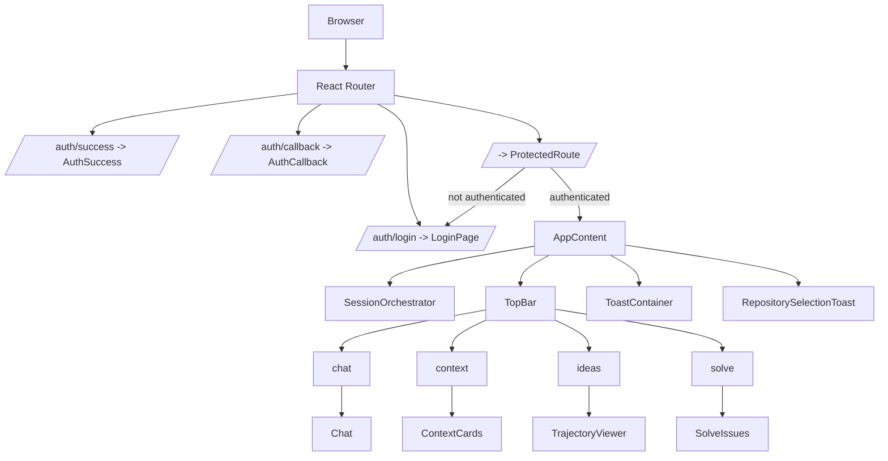
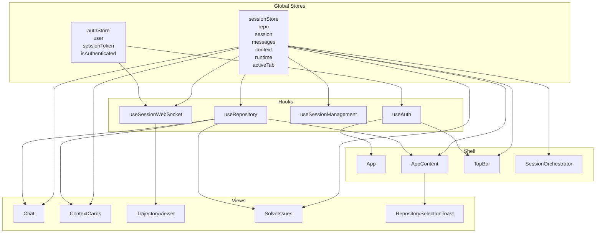
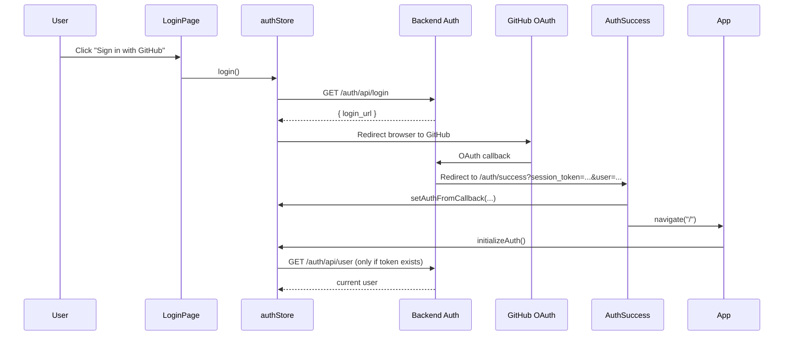
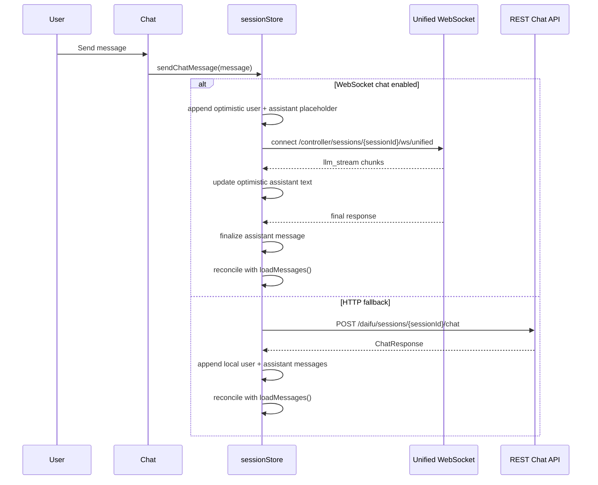
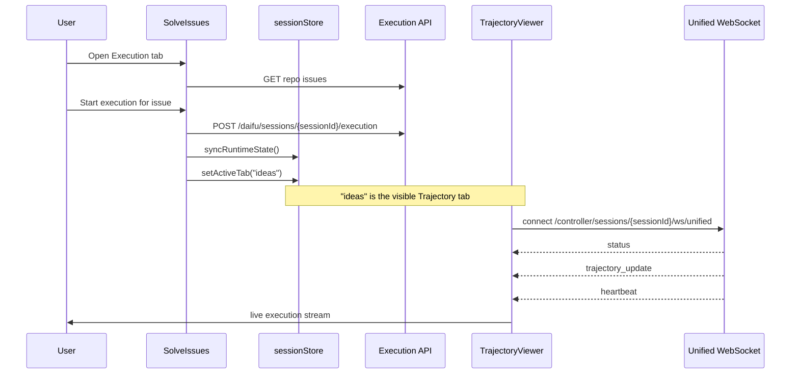
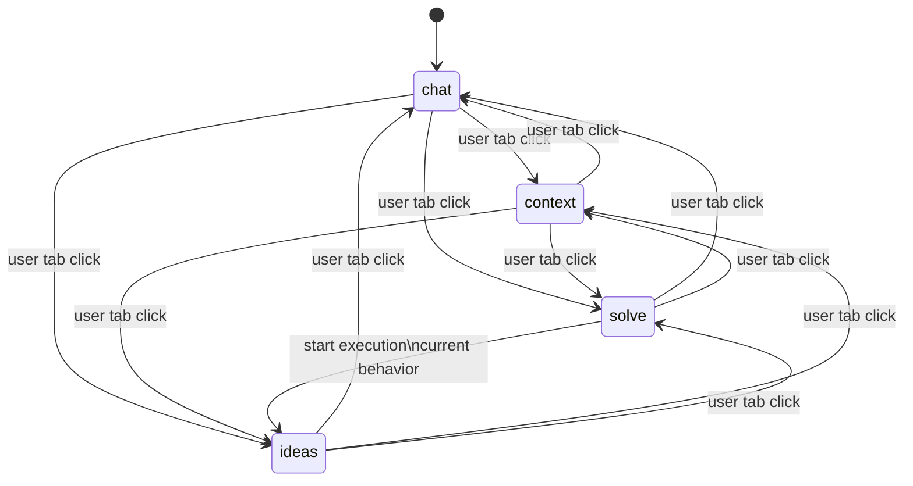

# Frontend Architecture

This document explains the current frontend structure in `src/`, the tab model, the main stores, and how the frontend talks to the backend.

## TL;DR

- The visible tabs are `Chat`, `Context`, `Trajectory`, and `Execution`.
- The internal tab key `ideas` is a legacy name. It now renders the `Trajectory` tab, not a separate ideas feature.
- The `Execution` tab (`SolveIssues`) starts a sandbox task.
- After execution starts, the app currently switches to the `Trajectory` tab for live streaming.
- GitHub auth was not fundamentally broken in `LoginPage.tsx`. The confusing part was an auth probe on app mount that used to call `/auth/api/user` even when there was no token yet.

## Route And Shell Structure

The app has a small public auth surface and one protected workspace route.



## Tabs

Current tabs are declared in `src/components/TopBar.tsx`.

| Internal key | Visible label | Rendered component | Purpose |
| --- | --- | --- | --- |
| `chat` | `Chat` | `Chat` | Main conversation with the session |
| `context` | `Context` | `ContextCards` | Curated context used for issue generation and session work |
| `ideas` | `Trajectory` | `TrajectoryViewer` | Live or static execution trajectory viewer |
| `solve` | `Execution` | `SolveIssues` | Pick a GitHub issue and start execution |

### Important naming note

`ideas` is not a separate user-facing ideas feature anymore.

It is a legacy internal tab id that now maps to:

- TopBar label: `Trajectory`
- Content component: `TrajectoryViewer`

That wiring currently lives in:

- `src/components/TopBar.tsx`
- `src/App.tsx`

## What Each Main Component Does

### `App`

`src/App.tsx`

- Owns route registration.
- Calls `initializeAuth()` on mount.
- Clears stale session state when the auth token changes.
- Wraps the whole app in `SessionErrorBoundary`.

### `ProtectedRoute`

`src/components/ProtectedRoute.tsx`

- Reads auth state from `useAuth()`.
- Shows a loading screen while auth is resolving.
- Redirects unauthenticated users to `/auth/login`.

### `LoginPage`

`src/components/LoginPage.tsx`

- Public landing page.
- Shows auth-related error messages from query params or auth store state.
- Calls `login()` when the GitHub button is clicked.
- `login()` fetches `/auth/api/login`, receives a GitHub OAuth URL, then redirects the browser there.

### `AuthSuccess`

`src/components/AuthSuccess.tsx`

- Handles the successful OAuth redirect from the backend.
- Parses `session_token`, `user_id`, `username`, and related user fields from the URL.
- Clears previous auth/session state.
- Writes the new auth state into `authStore`.
- Resets the active tab to `chat`.
- Redirects to `/`.

### `AuthCallback`

`src/components/AuthCallback.tsx`

- Handles OAuth error redirects.
- Reads `?error=...` from the URL and sends the user back to `/auth/login`.

### `AppContent`

`src/App.tsx`

- Owns the protected workspace shell.
- Decides which tab content to render based on `activeTab`.
- Shows the repository selector after login when no repo is selected.
- Owns toast state.

### `TopBar`

`src/components/TopBar.tsx`

- Shows:
  - current repository
  - session status
  - runtime status
  - tab buttons
  - indexing toggle
  - user profile/logout control

### `SessionOrchestrator`

`src/components/SessionOrchestrator.tsx`

- Centralizes session side effects.
- If user is authenticated and a repo is selected but no session exists, it creates one.
- If there is an active session that has not been validated yet, it validates it.
- Once a session is ready, it hydrates messages, context cards, and file dependencies.

This component is important because it keeps session creation and hydration out of the view components.

### `RepositorySelectionToast`

`src/components/RepositorySelectionToast.tsx`

- Modal/toast shown after login if no repository is selected.
- Loads repositories from the backend.
- Loads branches for the selected repository.
- Confirms a `{ repository, branch }` selection back to `AppContent`.

### `Chat`

`src/components/Chat.tsx`

- Main chat UI for the selected repo/session.
- Uses `useSessionStore` actions for message send and issue generation.
- Can turn conversation and context into a GitHub issue preview.

### `ContextCards`

`src/components/ContextCards.tsx`

- Displays curated context items.
- Allows removing context items.
- Can build an issue preview from context cards.

### `SolveIssues`

`src/components/SolveIssues.tsx`

- Loads repository issues.
- Lets the user choose an issue and start execution.
- Polls execution status over HTTP.
- After execution starts, it switches the app to the `ideas` tab, which is the visible `Trajectory` tab.

This is the key handoff:

- `Execution` tab starts the run.
- `Trajectory` tab shows the stream.

### `TrajectoryViewer`

`src/components/TrajectoryViewer.tsx`

- Renders execution trajectory data.
- In live mode, connects to the unified session WebSocket via `useSessionWebSocket`.
- In static mode, can render bundled trajectory JSON.

### `UserProfile`

`src/components/UserProfile.tsx`

- Shows logged-in user info.
- Shows the active repository.
- Calls `logout()`.

### `SessionErrorBoundary`

`src/components/SessionErrorBoundary.tsx`

- Catches session-related runtime errors in the protected app shell.
- Gives retry/reset options.

## Current Tab Behavior

The current tab behavior is:

1. After successful login, app should land on `chat`.
2. User selects a repository.
3. `SessionOrchestrator` creates or validates a session.
4. User can move manually between `Chat`, `Context`, `Trajectory`, and `Execution`.
5. If the user starts execution from `Execution`, `SolveIssues` currently sets `activeTab` to `ideas`, which shows `TrajectoryViewer`.

That transition is intentional in the current code, even though it is not aligned with your intended UX.

## Why You Saw The App Land On Solve

Historically:

- `activeTab` is persisted in `sessionStore`.
- If the previously persisted tab was `solve`, the app could restore it after auth redirect.

That is why the app appeared to land in the `Solve` tab after login.

It was not because GitHub OAuth picked the tab.

It was stale UI state restoration.

## Why GitHub Auth Looked Broken

The login button itself was straightforward:

```text
LoginPage -> authStore.login() -> GET /auth/api/login -> redirect to GitHub
```

What caused confusion was a separate mount-time auth check:

```text
App mount -> initializeAuth() -> GET /auth/api/user
```

Before the recent fix, that check happened even when no `sessionToken` existed yet. Since the backend uses Bearer auth, a missing `Authorization` header caused a `403` response.

That made the logs look like auth was failing, even though the actual GitHub OAuth button flow was not the part failing.

Current behavior is now:

- if there is no token, `initializeAuth()` does not call `/auth/api/user`
- after OAuth success, the app resets to `chat`

## State Structure

There are two main global stores:

- `authStore`
- `sessionStore`

### `authStore`

`src/stores/authStore.ts`

Purpose:

- track authenticated user identity
- hold the current session bearer token
- own login/logout/auth initialization actions

Shape:

```ts
{
  user,
  sessionToken,
  isAuthenticated,
  isLoading,
  error,
  initializeAuth,
  login,
  logout,
  refreshAuth,
  setAuthFromCallback,
  clearAuth
}
```

### `sessionStore`

`src/stores/sessionStore.ts`

Purpose:

- own selected repository
- own current daifu session
- own messages, context, file dependencies, issues
- own runtime state
- own some UI state like `activeTab`

High-level shape:

```ts
{
  // session
  activeSessionId,
  currentSession,
  sessionContext,
  sessionStatus,
  sessionInitialized,
  runtime,
  runtimeStatus,
  runtimeError,

  // repository
  selectedRepository,
  availableRepositories,
  repositoryError,

  // data
  messages,
  contextCards,
  fileContext,
  userIssues,

  // ui
  activeTab,
  sidebarCollapsed,
  sessionLoadingEnabled,
  indexCodebaseEnabled,

  // stats
  totalTokens,
  lastActivity,
  connectionStatus,

  // actions
  createSessionForRepository,
  ensureSessionExists,
  loadMessages,
  loadContextCards,
  loadFileDependencies,
  sendChatMessage,
  createIssueWithContext,
  syncRuntimeState,
  ...
}
```

### Local Component State

Some state stays local to components:

- `AppContent`
  - `toasts`
  - `showRepositorySelection`
- `RepositorySelectionToast`
  - selected repo and branch dropdown UI
- `SolveIssues`
  - selected issue modal
  - issue list
  - execution status polling result
- `TrajectoryViewer`
  - expanded messages
  - live WebSocket stream state

## State Ownership Diagram



## Backend Communication Map

These are the main frontend-to-backend channels.

| Area | Frontend caller | Transport | Backend endpoint |
| --- | --- | --- | --- |
| Start login | `authStore.login()` | HTTP GET | `/auth/api/login` |
| Resolve current user | `authStore.initializeAuth()` | HTTP GET | `/auth/api/user` |
| Logout | `authStore.logout()` | HTTP POST | `/auth/api/logout` |
| Load repos | `sessionStore.loadRepositories()` | HTTP GET | `/github/repositories` |
| Load branches | `sessionStore.loadRepositoryBranches()` | HTTP GET | `/github/repositories/{owner}/{repo}/branches` |
| Create session | `createSessionForRepository()` | HTTP POST | `/daifu/sessions` |
| Load session | `loadSession()` / `ensureSessionExists()` | HTTP GET | `/daifu/sessions/{sessionId}` |
| Load messages | `loadMessages()` | HTTP GET | `/daifu/sessions/{sessionId}/messages` |
| Load context cards | `loadContextCards()` | HTTP GET | `/daifu/sessions/{sessionId}/context-cards` |
| Load file deps | `loadFileDependencies()` | HTTP GET | `/daifu/sessions/{sessionId}/file-deps/session` |
| Send chat | `sendChatMessage()` | WebSocket first, HTTP fallback | `/controller/sessions/{sessionId}/ws/unified` or `/daifu/sessions/{sessionId}/chat` |
| Create issue preview | `createIssueWithContext()` | HTTP POST | `/daifu/sessions/{sessionId}/issues/create-with-context` |
| Fetch repo issues for execution | `SolveIssues` | HTTP GET | `/daifu/github/repositories/{owner}/{repo}/issues` |
| Start execution | `SolveIssues` | HTTP POST | `/daifu/sessions/{sessionId}/execution` |
| Poll execution status | `SolveIssues` | HTTP GET | `/daifu/sessions/{sessionId}/execution` |
| Cancel execution | `SolveIssues` | HTTP POST | `/daifu/sessions/{sessionId}/execution/cancel` |
| Runtime detail | `syncRuntimeState()` | HTTP GET | `/controller/sessions/{sessionId}/runtime` |
| Live trajectory stream | `TrajectoryViewer` via `useSessionWebSocket` | WebSocket | `/controller/sessions/{sessionId}/ws/unified` |

## Auth Flow



## Repository And Session Boot Flow

```mermaid
flowchart TD
    Login[AuthSuccess completed] --> Home[AppContent mounted]
    Home --> RepoCheck{selectedRepository exists?}

    RepoCheck -->|no| RepoToast[RepositorySelectionToast opens]
    RepoToast --> LoadRepos[GET /github/repositories]
    LoadRepos --> SelectRepo[User picks repo and branch]
    SelectRepo --> SetRepo[setSelectedRepository]

    RepoCheck -->|yes| Orchestrator[SessionOrchestrator]
    SetRepo --> Orchestrator

    Orchestrator --> NeedSession{activeSessionId exists?}
    NeedSession -->|no| CreateSession[POST /daifu/sessions]
    NeedSession -->|yes| ValidateSession[GET /daifu/sessions/{sessionId}]

    CreateSession --> Hydrate
    ValidateSession --> Hydrate[Load messages/context/file deps]

    Hydrate --> Ready[Workspace ready]
```

## Chat Flow



## Execution And Streaming Flow

This is the part that currently causes the visible tab handoff.



## Tab State Diagram



## Current Architectural Mismatches

These are the parts most likely to confuse someone reading the code:

1. Internal tab key `ideas` means `Trajectory`, not ideas.
2. `Execution` starts a run, but live streaming happens on `Trajectory`.
3. `activeTab` is persisted, which previously allowed stale tab restoration after login.
4. `SolveIssues` uses a direct issue-list endpoint string instead of going through the centralized API config constants.

## Recommended Mental Model

If you want a simple way to think about the current frontend:

- `authStore` = who the user is and whether there is a bearer token
- `sessionStore` = everything about the selected repo, active daifu session, runtime, and workspace UI
- `SessionOrchestrator` = the side-effect engine that makes repo selection turn into a hydrated session
- `Chat` = conversational work surface
- `ContextCards` = curated context surface
- `SolveIssues` = execution launcher
- `TrajectoryViewer` = execution monitor

## If You Want The UX To Match Your Intent

Your stated intent is:

- land on `Chat` after login
- stay out of `Solve` until user explicitly starts execution
- move to the streaming surface only when execution begins

The first part is now aligned.

The remaining decision is whether the streaming surface should:

1. stay as the current `Trajectory` tab, or
2. move into the `Execution` tab so one tab both launches and monitors the run

Right now the code implements option 1.
