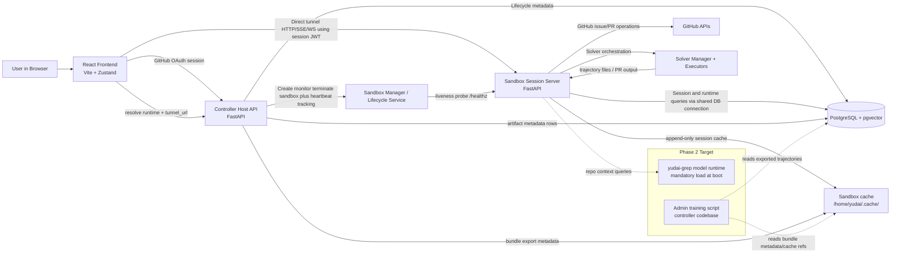

```mermaid
flowchart LR
  U[User in Browser] --> FE[React Frontend<br/>Vite + Zustand]

  FE -->|GitHub OAuth session| C[Controller Host API<br/>FastAPI]
  FE -->|resolve runtime + tunnel_url| C
  FE -->|Direct tunnel HTTP/SSE/WS using session JWT| S[Sandbox Session Server<br/>FastAPI]

  C -->|Lifecycle metadata| PG[(PostgreSQL + pgvector)]
  S -->|Session and runtime queries via shared DB connection| PG

  C -->|Create monitor terminate sandbox plus heartbeat tracking| SM[Sandbox Manager / Lifecycle Service]
  SM -->|liveness probe /healthz| S

  S -->|GitHub issue/PR operations| GH[GitHub APIs]
  S -->|Solver orchestration| SOLVER[Solver Manager + Executors]
  SOLVER -->|trajectory files / PR output| S

  S -->|append-only session cache| CACHE["Sandbox cache<br/>/home/yudai/.cache/"]
  C -->|artifact metadata rows| PG
  C -->|bundle export metadata| CACHE

  subgraph Phase2["Phase 2 Target"]
    YG[yudai-grep model runtime<br/>mandatory load at boot]
    TRAIN[Admin training script<br/>controller codebase]
  end

  S -. repo context queries .-> YG
  TRAIN -. reads exported trajectories .-> PG
  TRAIN -. reads bundle metadata/cache refs .-> CACHE
```
