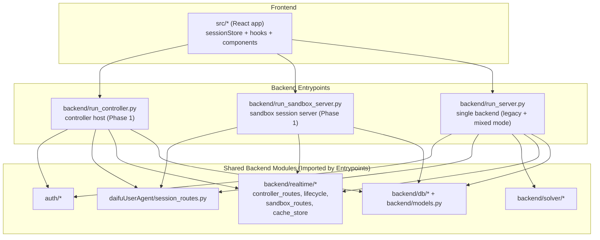

```mermaid
flowchart TB
  subgraph Frontend
    FE["src/* (React app)<br/>sessionStore + hooks + components"]
  end

  subgraph Backend_Entrypoints["Backend Entrypoints"]
    RS["backend/run_server.py<br/>single backend (legacy + mixed mode)"]
    RC["backend/run_controller.py<br/>controller host (Phase 1)"]
    RSS["backend/run_sandbox_server.py<br/>sandbox session server (Phase 1)"]
  end

  subgraph Shared_Modules["Shared Backend Modules (Imported by Entrypoints)"]
    AUTH["auth/*"]
    SESS["daifuUserAgent/session_routes.py"]
    RT["backend/realtime/*<br/>controller_routes, lifecycle,<br/>sandbox_routes, cache_store"]
    SOLV["backend/solver/*"]
    DB["backend/db/* + backend/models.py"]
  end

  FE --> RC
  FE --> RSS
  FE --> RS

  RC --> AUTH
  RC --> SESS
  RC --> RT
  RC --> DB

  RSS --> SESS
  RSS --> RT
  RSS --> DB

  RS --> AUTH
  RS --> SESS
  RS --> SOLV
  RS --> RT
  RS --> DB
```
