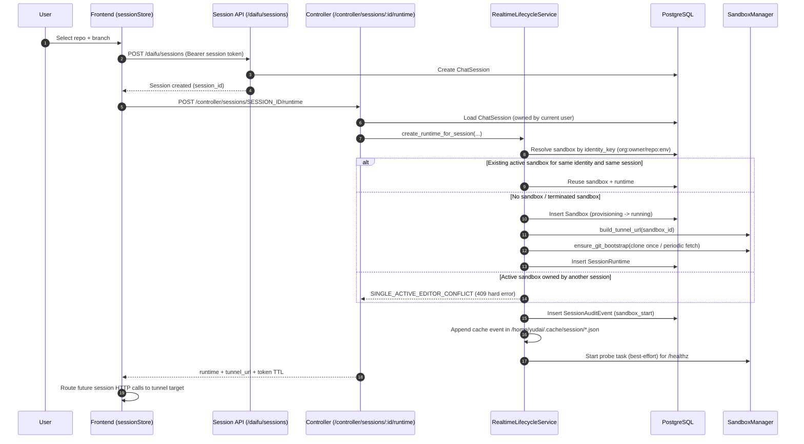

```mermaid
sequenceDiagram
  autonumber
  participant User
  participant FE as Frontend (sessionStore)
  participant API as Session API (/daifu/sessions)
  participant CTR as Controller (/controller/sessions/:id/runtime)
  participant L as RealtimeLifecycleService
  participant DB as PostgreSQL
  participant SM as SandboxManager

  User->>FE: Select repo + branch
  FE->>API: POST /daifu/sessions (Bearer session token)
  API->>DB: Create ChatSession
  API-->>FE: Session created (session_id)

  FE->>CTR: POST /controller/sessions/SESSION_ID/runtime
  CTR->>DB: Load ChatSession (owned by current user)
  CTR->>L: create_runtime_for_session(...)
  L->>DB: Resolve sandbox by identity_key (org:owner/repo:env)
  alt Existing active sandbox for same identity and same session
    L->>DB: Reuse sandbox + runtime
  else No sandbox / terminated sandbox
    L->>DB: Insert Sandbox (provisioning -> running)
    L->>SM: build_tunnel_url(sandbox_id)
    L->>SM: ensure_git_bootstrap(clone once / periodic fetch)
    L->>DB: Insert SessionRuntime
  else Active sandbox owned by another session
    L-->>CTR: SINGLE_ACTIVE_EDITOR_CONFLICT (409 hard error)
  end
  L->>DB: Insert SessionAuditEvent (sandbox_start)
  L->>L: Append cache event in /home/yudai/.cache/session/*.json
  L->>SM: Start probe task (best-effort) for /healthz
  CTR-->>FE: runtime + tunnel_url + token TTL

  FE->>FE: Route future session HTTP calls to tunnel target
```
