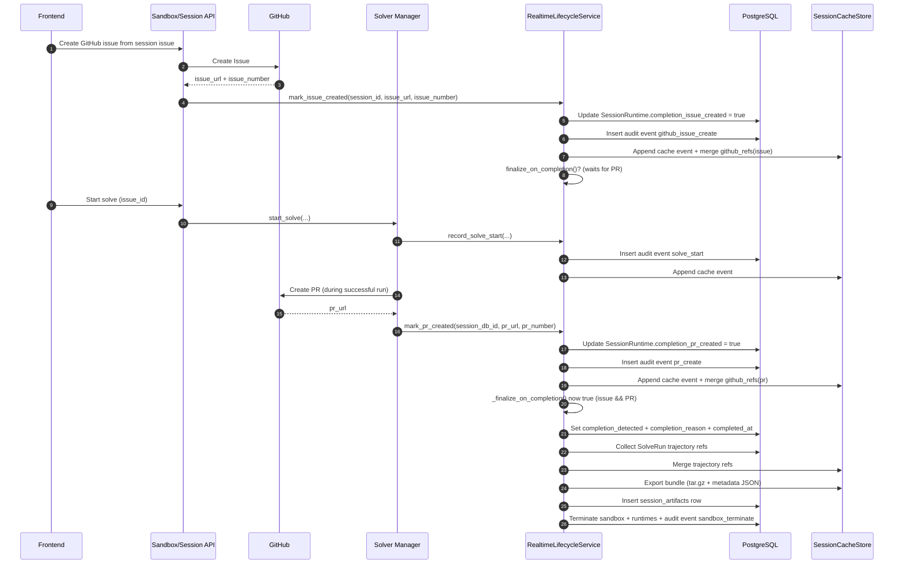

```mermaid
sequenceDiagram
  autonumber
  participant FE as Frontend
  participant S as Sandbox/Session API
  participant GH as GitHub
  participant SOL as Solver Manager
  participant L as RealtimeLifecycleService
  participant DB as PostgreSQL
  participant C as SessionCacheStore

  FE->>S: Create GitHub issue from session issue
  S->>GH: Create Issue
  GH-->>S: issue_url + issue_number
  S->>L: mark_issue_created(session_id, issue_url, issue_number)
  L->>DB: Update SessionRuntime.completion_issue_created = true
  L->>DB: Insert audit event github_issue_create
  L->>C: Append cache event + merge github_refs(issue)
  L->>L: finalize_on_completion()? (waits for PR)

  FE->>S: Start solve (issue_id)
  S->>SOL: start_solve(...)
  SOL->>L: record_solve_start(...)
  L->>DB: Insert audit event solve_start
  L->>C: Append cache event

  SOL->>GH: Create PR (during successful run)
  GH-->>SOL: pr_url
  SOL->>L: mark_pr_created(session_db_id, pr_url, pr_number)
  L->>DB: Update SessionRuntime.completion_pr_created = true
  L->>DB: Insert audit event pr_create
  L->>C: Append cache event + merge github_refs(pr)

  L->>L: _finalize_on_completion() now true (issue && PR)
  L->>DB: Set completion_detected + completion_reason + completed_at
  L->>DB: Collect SolveRun trajectory refs
  L->>C: Merge trajectory refs
  L->>C: Export bundle (tar.gz + metadata JSON)
  L->>DB: Insert session_artifacts row
  L->>DB: Terminate sandbox + runtimes + audit event sandbox_terminate
```
