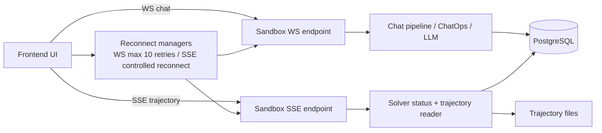

```mermaid
flowchart LR
  FE[Frontend UI] -->|WS chat| WS[Sandbox WS endpoint]
  FE -->|SSE trajectory| SSE[Sandbox SSE endpoint]

  WS --> CHAT[Chat pipeline / ChatOps / LLM]
  SSE --> SOLV[Solver status + trajectory reader]

  CHAT --> DB[(PostgreSQL)]
  SOLV --> DB
  SOLV --> TRJ[Trajectory files]

  FE --> RECON[Reconnect managers<br/>WS max 10 retries / SSE controlled reconnect]
  RECON --> WS
  RECON --> SSE
```
