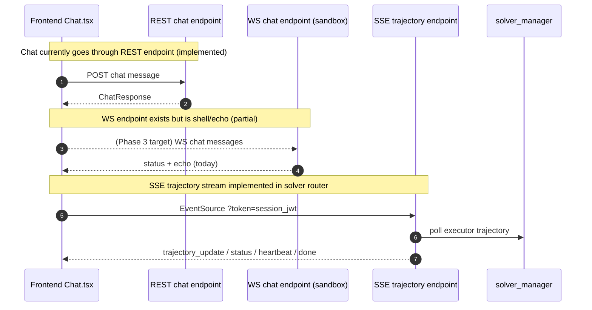

```mermaid
sequenceDiagram
  autonumber
  participant FE as Frontend Chat.tsx
  participant REST as REST chat endpoint
  participant WS as WS chat endpoint (sandbox)
  participant SSE as SSE trajectory endpoint
  participant Solver as solver_manager

  Note over FE,REST: Chat currently goes through REST endpoint (implemented)
  FE->>REST: POST chat message
  REST-->>FE: ChatResponse

  Note over FE,WS: WS endpoint exists but is shell/echo (partial)
  FE-->>WS: (Phase 3 target) WS chat messages
  WS-->>FE: status + echo (today)

  Note over FE,SSE: SSE trajectory stream implemented in solver router
  FE->>SSE: EventSource ?token=session_jwt
  SSE->>Solver: poll executor trajectory
  SSE-->>FE: trajectory_update / status / heartbeat / done
```
