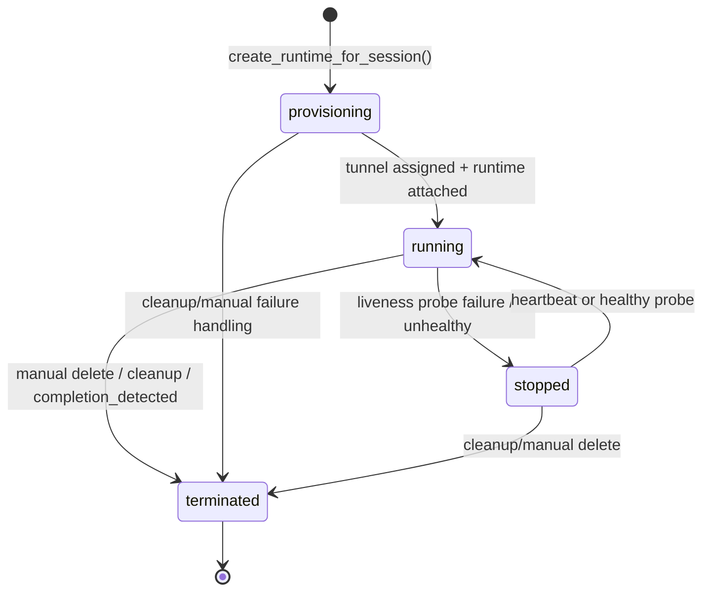

```mermaid
stateDiagram-v2
  [*] --> provisioning : create_runtime_for_session()
  provisioning --> running : tunnel assigned + runtime attached
  running --> stopped : liveness probe failure / unhealthy
  stopped --> running : heartbeat or healthy probe
  running --> terminated : manual delete / cleanup / completion_detected
  provisioning --> terminated : cleanup/manual failure handling
  stopped --> terminated : cleanup/manual delete
  terminated --> [*]
```
