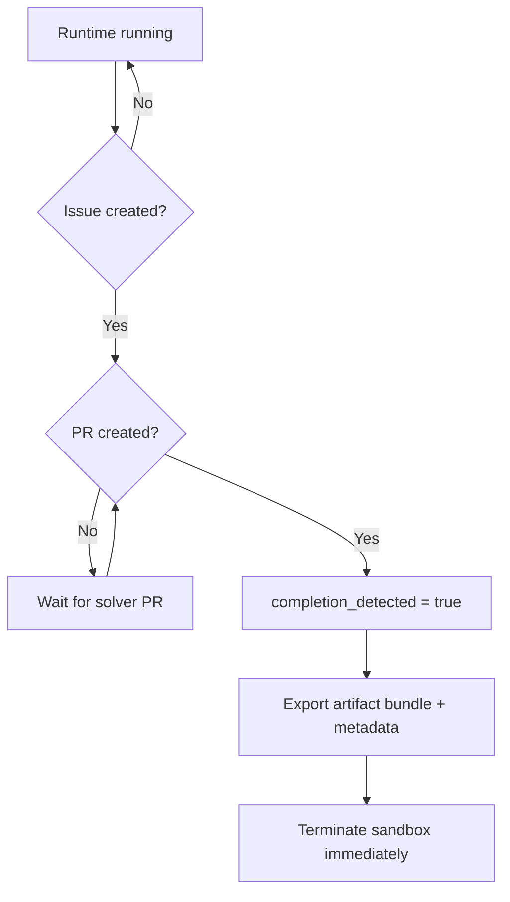

```mermaid
flowchart TD
  R0[Runtime running] --> I{Issue created?}
  I -->|No| R0
  I -->|Yes| P{PR created?}
  P -->|No| W[Wait for solver PR]
  W --> P
  P -->|Yes| C[completion_detected = true]
  C --> X[Export artifact bundle + metadata]
  X --> T[Terminate sandbox immediately]
```
