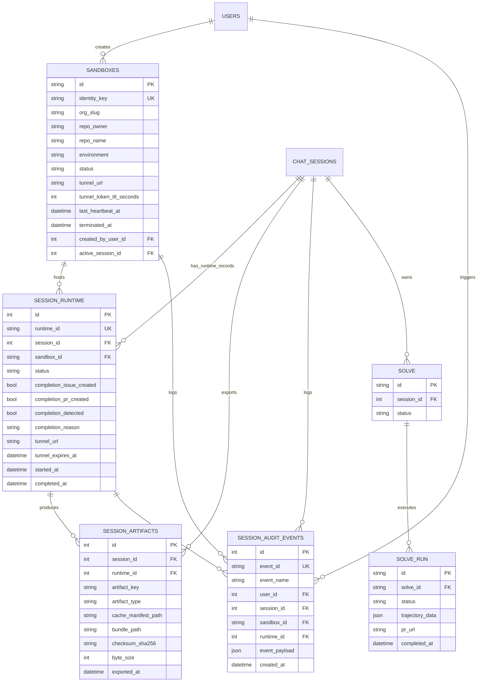

```mermaid
erDiagram
  USERS ||--o{ SANDBOXES : creates
  USERS ||--o{ SESSION_AUDIT_EVENTS : triggers
  CHAT_SESSIONS ||--o{ SESSION_RUNTIME : has_runtime_records
  SANDBOXES ||--o{ SESSION_RUNTIME : hosts
  CHAT_SESSIONS ||--o{ SESSION_ARTIFACTS : exports
  SESSION_RUNTIME ||--o{ SESSION_ARTIFACTS : produces
  CHAT_SESSIONS ||--o{ SESSION_AUDIT_EVENTS : logs
  SANDBOXES ||--o{ SESSION_AUDIT_EVENTS : logs
  SESSION_RUNTIME ||--o{ SESSION_AUDIT_EVENTS : logs
  CHAT_SESSIONS ||--o{ SOLVE : owns
  SOLVE ||--o{ SOLVE_RUN : executes

  SANDBOXES {
    string id PK
    string identity_key UK
    string org_slug
    string repo_owner
    string repo_name
    string environment
    string status
    string tunnel_url
    int tunnel_token_ttl_seconds
    datetime last_heartbeat_at
    datetime terminated_at
    int created_by_user_id FK
    int active_session_id FK
  }

  SESSION_RUNTIME {
    int id PK
    string runtime_id UK
    int session_id FK
    string sandbox_id FK
    string status
    bool completion_issue_created
    bool completion_pr_created
    bool completion_detected
    string completion_reason
    string tunnel_url
    datetime tunnel_expires_at
    datetime started_at
    datetime completed_at
  }

  SESSION_ARTIFACTS {
    int id PK
    int session_id FK
    int runtime_id FK
    string artifact_key
    string artifact_type
    string cache_manifest_path
    string bundle_path
    string checksum_sha256
    int byte_size
    datetime exported_at
  }

  SESSION_AUDIT_EVENTS {
    int id PK
    string event_id UK
    string event_name
    int user_id FK
    int session_id FK
    string sandbox_id FK
    int runtime_id FK
    json event_payload
    datetime created_at
  }

  SOLVE {
    string id PK
    int session_id FK
    string status
  }

  SOLVE_RUN {
    string id PK
    string solve_id FK
    string status
    json trajectory_data
    string pr_url
    datetime completed_at
  }
```
