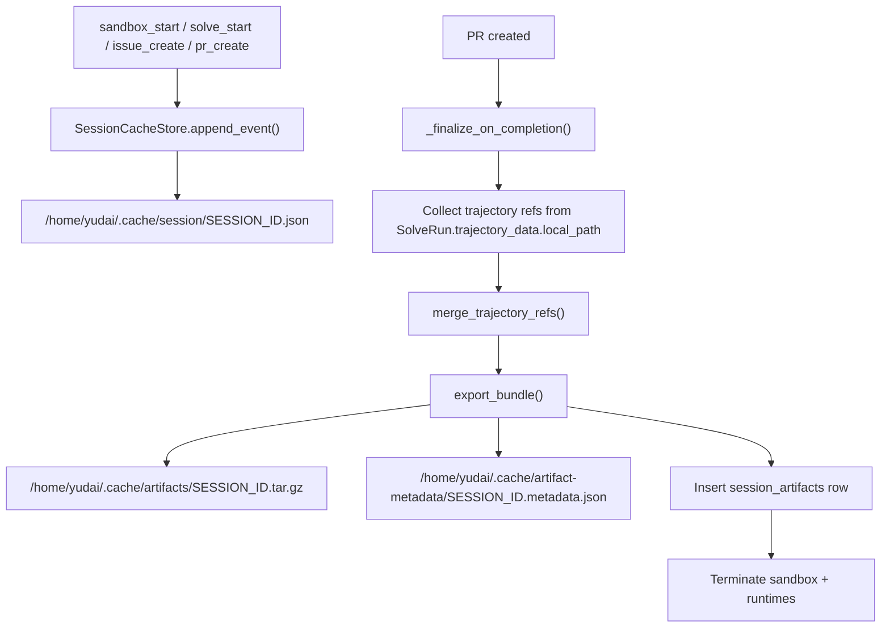

```mermaid
flowchart TB
  E1["sandbox_start / solve_start / issue_create / pr_create"] --> APPEND["SessionCacheStore.append_event()"]
  APPEND --> MANIFEST["/home/yudai/.cache/session/SESSION_ID.json"]

  PR["PR created"] --> FINALIZE["_finalize_on_completion()"]
  FINALIZE --> COLLECT["Collect trajectory refs from SolveRun.trajectory_data.local_path"]
  COLLECT --> MERGE["merge_trajectory_refs()"]
  MERGE --> EXPORT["export_bundle()"]

  EXPORT --> TAR["/home/yudai/.cache/artifacts/SESSION_ID.tar.gz"]
  EXPORT --> META["/home/yudai/.cache/artifact-metadata/SESSION_ID.metadata.json"]
  EXPORT --> DBROW["Insert session_artifacts row"]

  DBROW --> TERM["Terminate sandbox + runtimes"]
```
