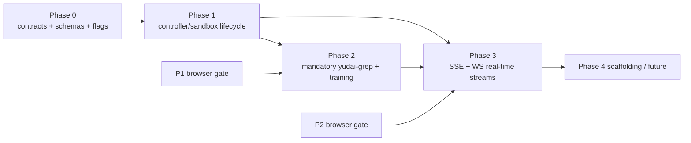

```mermaid
flowchart LR
  P0[Phase 0<br/>contracts + schemas + flags] --> P1[Phase 1<br/>controller/sandbox lifecycle]
  P1 --> P2[Phase 2<br/>mandatory yudai-grep + training]
  P1 --> P3[Phase 3<br/>SSE + WS real-time streams]
  P2 --> P3
  P3 --> P4[Phase 4 scaffolding / future]

  B1[P1 browser gate] --> P2
  B2[P2 browser gate] --> P3
```
