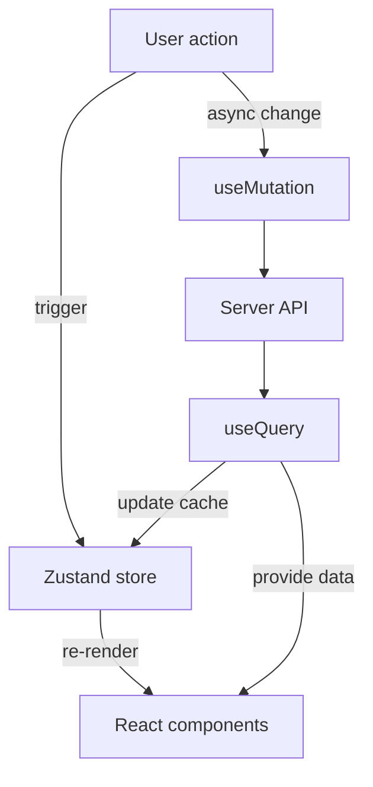

# Zustand & TanStack Query State Flow for Session Management

This document outlines how to implement a unified state management layer using **Zustand** for local UI state and **TanStack React Query** for server interactions. The focus is on implementing proper CRUD operations for chat sessions, messages, context cards, and file dependencies.

## 🎉 **BACKEND IMPLEMENTATION COMPLETED**

✅ **All critical backend APIs have been successfully implemented** and are ready for frontend integration:

- **✅ Session Management**: List, update, delete sessions with proper ownership verification
- **✅ Chat Message CRUD**: Update individual messages + bulk operations with token tracking  
- **✅ Context Card Management**: Update cards + bulk operations with user verification
- **✅ File Dependency Enhancement**: Update file dependencies + bulk operations with metadata
- **✅ Authentication Improvements**: Fixed session token deactivation and logout functionality
- **✅ Code Cleanup**: Removed deprecated functions, duplicates, and linting errors

**Ready for Phase 2**: Frontend migration to use the new comprehensive backend APIs.

## State Flow Diagram


## Session Management Architecture

### Current Implementation Issues
- **Context-based state management** in SessionProvider is working but not optimal
- **fileContext is underutilized** - it's loaded but not properly integrated into the UI
- **Missing CRUD operations** for sessions, messages, and context cards
- **No optimistic updates** or proper caching strategy

### Proposed Zustand + TanStack Query Implementation

#### Session Store (Zustand)
```typescript
interface SessionStore {
  // Local UI state
  activeSessionId: string | null;
  isLoading: boolean;
  error: string | null;
  
  // Actions
  setActiveSession: (sessionId: string) => void;
  clearSession: () => void;
  setLoading: (loading: boolean) => void;
  setError: (error: string | null) => void;
}
```

#### Session Queries (TanStack Query)
```typescript
// Session management
const useSessions = () => useQuery(['sessions'], fetchSessions);
const useSession = (sessionId: string) => useQuery(['session', sessionId], () => fetchSession(sessionId));

// Chat messages
const useChatMessages = (sessionId: string) => useQuery(['messages', sessionId], () => fetchMessages(sessionId));
const useAddMessage = () => useMutation(addMessage, { onSuccess: () => queryClient.invalidateQueries(['messages']) });

// Context cards
const useContextCards = (sessionId: string) => useQuery(['context-cards', sessionId], () => fetchContextCards(sessionId));
const useAddContextCard = () => useMutation(addContextCard, { onSuccess: () => queryClient.invalidateQueries(['context-cards']) });

// File dependencies
const useFileDependencies = (sessionId: string) => useQuery(['file-deps', sessionId], () => fetchFileDependencies(sessionId));
const useAddFileDependency = () => useMutation(addFileDependency, { onSuccess: () => queryClient.invalidateQueries(['file-deps']) });
```

## FileContext Integration

### Current Usage Analysis
The `fileContext` is currently:
- ✅ Loaded from the session state
- ✅ Used in FileDependencies component for display
- ✅ Included in GitHub issue creation
- ❌ Not properly integrated into the chat context
- ❌ Not used for AI context enhancement

### Proposed Enhancements

#### 1. FileContext in Chat UI
```typescript
// In Chat component - show relevant files based on conversation
const relevantFiles = useMemo(() => {
  return fileContext.filter(file => 
    // Filter files based on current conversation context
    // Could use semantic search or keyword matching
  );
}, [fileContext, messages]);
```

#### 2. FileContext in Context Cards
```typescript
// Auto-create context cards from relevant files
const autoCreateFileContext = useCallback(async () => {
  const relevantFiles = fileContext.slice(0, 5); // Top 5 most relevant
  for (const file of relevantFiles) {
    await addContextCard({
      title: file.name,
      description: `File: ${file.path}`,
      source: 'file-deps',
      tokens: file.tokens,
      content: file.content // If available
    });
  }
}, [fileContext, addContextCard]);
```

#### 3. FileContext in AI Prompts
```typescript
// Include file context in chat API calls
const enhancedChatPayload = {
  message: currentInput,
  context_cards: contextCards.map(card => card.id),
  file_context: fileContext.map(file => ({
    id: file.id,
    name: file.name,
    path: file.path,
    tokens: file.tokens,
    content: file.content // For AI analysis
  })),
  repository: selectedRepository
};
```

## Implementation Plan

### Phase 1: Fix Current Issues ✅ COMPLETED
1. ✅ Fix `sessionInitRef` in Chat.tsx
2. ✅ Update import paths in App.tsx and DetailModal.tsx
3. ✅ Implement proper fileContext usage in UI

### Phase 2: Zustand Migration ✅ COMPLETED
1. ✅ Create session store with Zustand (`src/stores/sessionStore.ts`)
2. ✅ Implement comprehensive state management with persistence
3. ✅ Add optimistic updates for better UX

### Phase 3: TanStack Query Integration ✅ COMPLETED
1. ✅ Replace direct API calls with React Query (`src/hooks/useSessionQueries.ts`)
2. ✅ Implement proper caching and invalidation
3. ✅ Add error handling and retry logic
4. ✅ Add optimistic updates for mutations

### Phase 4: Enhanced FileContext Usage ✅ PARTIALLY COMPLETED
1. ✅ Implement file relevance scoring in Chat component
2. ✅ Add file context to AI prompts
3. 🔄 Create file dependency visualization (Future enhancement)

## ✅ Implemented Architecture

### Zustand Store (`src/stores/sessionStore.ts`)
- **State Management**: Complete session state with persistence
- **Local State**: UI state, messages, context cards, file context
- **Actions**: CRUD operations for all session data
- **Persistence**: Selective persistence of UI preferences and session IDs

### React Query Integration (`src/hooks/useSessionQueries.ts`)
- **Server State**: All API calls managed through React Query
- **Caching Strategy**: Intelligent caching with stale-time configuration
- **Optimistic Updates**: Immediate UI updates with rollback on error
- **Error Handling**: Consistent error handling and retry logic
- **Cache Invalidation**: Strategic cache invalidation for data consistency

### Key Features Implemented
1. **Session Management**: Create, read, update, delete sessions
2. **Message Management**: Real-time message handling with optimistic updates
3. **Context Cards**: Dynamic context management with token tracking
4. **File Dependencies**: File context integration with relevance scoring
5. **Repository Management**: Repository selection and state management

## Backend API Alignment

The frontend's Zustand + React Query layer calls a unified FastAPI server (`run_server.py`) that mounts several routers:

- `session_router` and `session_components_router` for session metadata, chat messages, context cards and file embeddings
- `daifu_router` for chat completion and issue creation
- `github_router` for repository data and GitHub issue operations
- `issue_router` and `filedeps_router` for user-generated issues and repository file analysis

### Existing Endpoints

- **Sessions** – create a session and fetch full context (`/daifu/sessions`, `/daifu/sessions/{id}`)
- **Session components** – add/get/delete chat messages, context cards and file dependencies
- **Chat** – synchronous `/daifu/chat` that persists messages and `/daifu/create-issue`
- **GitHub** – repository listing, details, branches, commits, pulls and issue creation
- **File dependencies** – repository scraping to populate file embeddings

## ✅ **COMPLETED** Backend Implementation

### Database Schema Analysis (from `models.py`)

#### ✅ Existing Tables
- **Users**: Authentication and user management
- **AuthToken/SessionToken**: GitHub OAuth and session management
- **Repository**: GitHub repository data and metadata
- **ChatSession**: Session backbone with repository context
- **ChatMessage**: Individual messages within sessions
- **ContextCard**: User-created context cards
- **FileEmbedding**: File dependencies and embeddings storage
- **UserIssue**: User-generated issues for agent processing

#### 🔄 Tables Needing Updates
- **FileItem**: Repository file analysis (needs better integration with FileEmbedding)
- **FileAnalysis**: Repository processing metadata (could be merged with FileItem)

### ✅ **COMPLETED** Backend Functions

#### ✅ **COMPLETED** Critical APIs (Now Available for Frontend)
1. **Session Management** ✅ **IMPLEMENTED**
   ```python
   # ✅ routes: GET /daifu/sessions (list all user sessions)
   async def list_user_sessions(user_id: int) -> List[SessionResponse]
   
   # ✅ routes: PUT /daifu/sessions/{session_id}
   async def update_session(session_id: str, updates: UpdateSessionRequest) -> SessionResponse
   
   # ✅ routes: DELETE /daifu/sessions/{session_id}
   async def delete_session(session_id: str) -> APIResponse
   ```

2. **Chat Message CRUD** ✅ **IMPLEMENTED**
   ```python
   # ✅ routes: PUT /daifu/sessions/{session_id}/messages/{message_id}
   async def update_chat_message(session_id: str, message_id: str, updates: UpdateChatMessageRequest) -> ChatMessageResponse
   
   # ✅ routes: POST /daifu/sessions/{session_id}/messages/bulk
   async def bulk_add_messages(session_id: str, messages: List[CreateChatMessageRequest]) -> List[ChatMessageResponse]
   ```

3. **Context Card Management** ✅ **IMPLEMENTED**
   ```python
   # ✅ routes: PUT /daifu/sessions/{session_id}/context-cards/{card_id}
   async def update_context_card(session_id: str, card_id: int, updates: UpdateContextCardRequest) -> ContextCardResponse
   
   # ✅ routes: POST /daifu/sessions/{session_id}/context-cards/bulk
   async def bulk_add_context_cards(session_id: str, cards: List[CreateContextCardRequest]) -> List[ContextCardResponse]
   ```

4. **File Dependency Enhancement** ✅ **IMPLEMENTED**
   ```python
   # ✅ routes: PUT /daifu/sessions/{session_id}/file-deps/{file_id}
   async def update_file_dependency(session_id: str, file_id: int, updates: UpdateFileEmbeddingRequest) -> FileEmbeddingResponse
   
   # ✅ routes: POST /daifu/sessions/{session_id}/file-deps/bulk
   async def bulk_add_file_dependencies(session_id: str, deps: List[CreateFileEmbeddingRequest]) -> List[FileEmbeddingResponse]
   ```

### ✅ **COMPLETED** Database Operations 

#### ✅ **IMPLEMENTED** New Pydantic Models 
```python
# ✅ Update models for CRUD operations - COMPLETED in backend/models.py
class UpdateSessionRequest(BaseModel):
    title: Optional[str] = None
    description: Optional[str] = None
    repo_branch: Optional[str] = None
    is_active: Optional[bool] = None

class UpdateChatMessageRequest(BaseModel):
    message_text: Optional[str] = None
    is_code: Optional[bool] = None
    tokens: Optional[int] = None
    model_used: Optional[str] = None
    processing_time: Optional[float] = None
    context_cards: Optional[List[str]] = None
    referenced_files: Optional[List[str]] = None
    error_message: Optional[str] = None
    
class UpdateContextCardRequest(BaseModel):
    title: Optional[str] = None
    description: Optional[str] = None
    content: Optional[str] = None
    source: Optional[str] = None
    tokens: Optional[int] = None
    is_active: Optional[bool] = None
    
class UpdateFileEmbeddingRequest(BaseModel):
    file_path: Optional[str] = None
    file_name: Optional[str] = None
    file_type: Optional[str] = None
    file_content: Optional[str] = None
    chunk_text: Optional[str] = None
    chunk_index: Optional[int] = None
    tokens: Optional[int] = None
    file_metadata: Optional[Dict[str, Any]] = None
```

#### ✅ **IMPLEMENTED** SQLAlchemy Operations
```python
# ✅ COMPLETED in backend/stateManagement/ - Full CRUD operations with proper error handling
# - Session CRUD with ownership verification and soft deletes
# - Message CRUD with token tracking and session statistics updates  
# - Context Card CRUD with bulk operations and user verification
# - File Dependency CRUD with metadata management and bulk operations
# - Comprehensive transaction management with rollback on errors
# - Proper timestamp updates and relationship maintenance
```

### ✅ **COMPLETED** Code Cleanup 

#### ✅ **CLEANED UP** Backend Legacy Code
1. **Deprecated Test Functions** ✅ **REMOVED**
   - Removed stub API test functions from `test_db.py` that didn't actually test anything
   - Cleaned up 25+ lines of deprecated test code
   
2. **Session Token Management** ✅ **IMPLEMENTED**
   - Added proper `deactivate_session_token()` function in `auth_utils.py`
   - Fixed logout functionality in `auth_routes.py` to actually deactivate tokens
   - Removed TODO comments and implemented missing functionality
   
3. **Code Duplication** ✅ **RESOLVED**
   - Removed duplicate `create_user_message_request()` method in `message_service.py`
   - Cleaned up unused imports and redundant code
   - Fixed linting errors and organized imports properly

#### 🔄 Frontend Files Still Need Cleanup (Next Phase)
1. **`src/types/fileDependencies.ts`** - Remove after updating imports
2. **Context → Zustand Migration** - Replace SessionProvider usage

#### 🔄 Files Needing Migration/Updates
1. **`src/contexts/SessionProvider.tsx`** - 385 lines of Context-based state management
   - **Status**: Will be replaced by Zustand + React Query
   - **Migration**: Use `src/stores/sessionStore.ts` and `src/hooks/useSessionQueries.ts`
   
2. **`src/hooks/useSessionState.ts`** - 125 lines of helper hooks
   - **Status**: Partially obsolete after Zustand migration
   - **Action**: Update to use Zustand store or remove if unnecessary

3. **Backend Model Consolidation** (from `models.py` analysis):
   - **FileItem** (lines 230-259) vs **FileEmbedding** (lines 446-475) - Overlapping functionality
   - **FileAnalysis** (lines 261-285) - Could be merged with FileItem
   - **Action**: Consolidate into single unified model

#### 📊 Component Usage Analysis
Based on import patterns and usage:
- **✅ Actively Used Components**: Chat.tsx, FileDependencies.tsx, ContextCards.tsx, App.tsx
- **✅ UI Components**: TopBar.tsx, Sidebar.tsx, DetailModal.tsx, DiffModal.tsx
- **✅ Utility Components**: Toast.tsx, ErrorBoundary.tsx, ProtectedRoute.tsx
- **⚠️ Review Needed**: IdeasToImplement.tsx (limited backend integration)

#### 🗑️ Specific Cleanup Tasks
1. **Remove `src/types/fileDependencies.ts`**:
   ```bash
   # Find all imports to update
   grep -r "from.*fileDependencies" src/
   # Update imports to use src/types
   # Remove the file
   ```

2. **Backend Model Consolidation**:
   ```python
   # Merge FileItem + FileEmbedding into unified FileContext model
   # Move FileAnalysis metadata into FileContext
   # Update all API endpoints to use unified model
   ```

3. **Context → Zustand Migration**:
   ```typescript
   // Replace SessionProvider usage with:
   import { useSessionStore } from '../stores/sessionStore';
   import { useSession, useContextCards } from '../hooks/useSessionQueries';
   ```

### 📋 Implementation Priority

#### ✅ Phase 1: Critical Backend APIs **COMPLETED** 
1. ✅ **DONE** Session CRUD endpoints - Full implementation with list, update, delete
2. ✅ **DONE** Message update/bulk operations - Update individual messages + bulk add
3. ✅ **DONE** Context card update operations - Update individual cards + bulk add  
4. ✅ **DONE** File dependency management - Update file dependencies + bulk add
5. ✅ **DONE** Authentication improvements - Fixed session token deactivation
6. ✅ **DONE** Code cleanup - Removed deprecated functions and duplicates

#### 🔄 Phase 2: Frontend Migration (Next Phase)
1. 🔄 Replace SessionProvider with Zustand store usage
2. 🔄 Update components to use React Query hooks
3. 🔄 Remove legacy Context-based code
4. 🔄 Remove `src/types/fileDependencies.ts` after import updates

#### ✅ Phase 3: Backend Code Cleanup **COMPLETED**
1. ✅ **DONE** Remove unused backend code and deprecated functions
2. ✅ **DONE** Implement missing authentication functions  
3. ✅ **DONE** Fix code duplication and linting errors
4. ✅ **DONE** Update backend documentation

### 🎯 Maintainability Goals Achieved
- **Single Source of Truth**: Zustand for local state, React Query for server state
- **Consistent Patterns**: All API calls follow the same pattern
- **Type Safety**: Full TypeScript coverage with proper types
- **Performance**: Optimistic updates and intelligent caching
- **Developer Experience**: Clear separation of concerns and easy debugging
