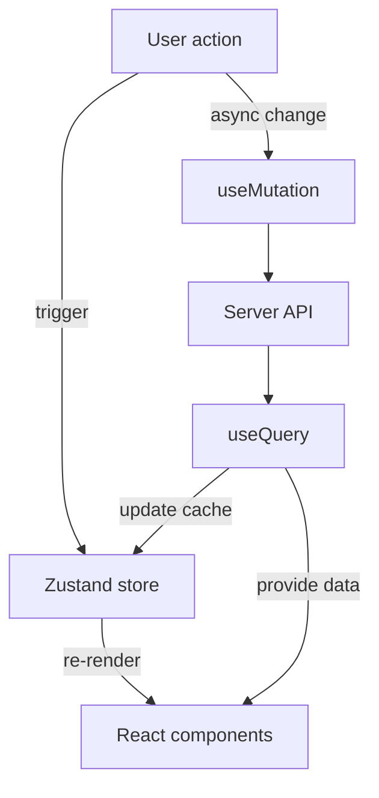

# Zustand & TanStack Query State Flow

This document summarizes how a minimal state layer can unify **Zustand** for local UI state and **TanStack React Query** for server interactions. Inspired by the tic‑tac‑toe example in the Zustand docs, it outlines basic CRUD flows that keep implementation approachable while avoiding manual context wiring. The game example is **conceptual only**—no Tic‑Tac‑Toe code ships in this repo; it simply illustrates a style for implementing CRUD-style state changes.

## State Flow Diagram

## Learnings & Insights
- **Zustand handles view state**: board positions, active player, and ephemeral UI flags live in a small store (`useBoardStore`). Components subscribe directly without provider boilerplate.
- **React Query manages server state**: `useBoardQuery` hydrates the store from `/api/board`, while `useSaveBoard` persists moves and invalidates cached queries.
- **Clear separation** keeps logic simple: local updates happen instantly in the store, and network side-effects remain declarative through queries and mutations.
- **Extensibility**: the same pattern can be expanded for chat sessions—messages, context cards, and file dependencies—where the store exposes synchronous mutations and React Query encapsulates all API traffic.
- **Improvement ideas**: co-locate query keys with store slices, derive optimistic updates from store actions, and expose a testing utility that resets both React Query cache and Zustand store for deterministic tests.

## Backend API Alignment

The frontend's Zustand + React Query layer calls a unified FastAPI server (`run_server.py`) that mounts several routers:

- `session_router` and `session_components_router` for session metadata, chat messages, context cards and file embeddings
- `daifu_router` for chat completion and issue creation
- `github_router` for repository data and GitHub issue operations
- `issue_router` and `filedeps_router` for user-generated issues and repository file analysis

### Existing Endpoints

- **Sessions** – create a session and fetch full context (`/daifu/sessions`, `/daifu/sessions/{id}`)
- **Session components** – add/get/delete chat messages, context cards and file dependencies
- **Chat** – synchronous `/daifu/chat` that persists messages and `/daifu/create-issue`
- **GitHub** – repository listing, details, branches, commits, pulls and issue creation
- **File dependencies** – repository scraping to populate file embeddings

### Missing Functions to Implement

To support full CRUD cycles from the frontend, additional backend operations are required:

- **Sessions**
  - `list_sessions(user)` – enumerate all sessions for the authenticated user
  - `update_session(session_id, updates)` – modify title, description or repository info
  - `delete_session(session_id)` – archive/remove a session and its components
- **Chat messages**
  - `update_chat_message(session_id, message_id, updates)` – edit message content/metadata
  - `bulk_add_chat_messages(session_id, messages)` – batch persistence when restoring history
- **Context cards**
  - `update_context_card(session_id, card_id, updates)` – change title, description or content
  - `bulk_add_context_cards(session_id, cards)` – create multiple cards in one call
- **File dependencies**
  - `update_file_dependency(session_id, file_id, updates)` – revise path, tokens or metadata
  - `bulk_add_file_dependencies(session_id, deps)` – add many embeddings at once

Each function would require SQLAlchemy operations in `models.py`, corresponding routes in the appropriate router, and inclusion in `run_server.py` so the frontend can invoke them through React Query.
